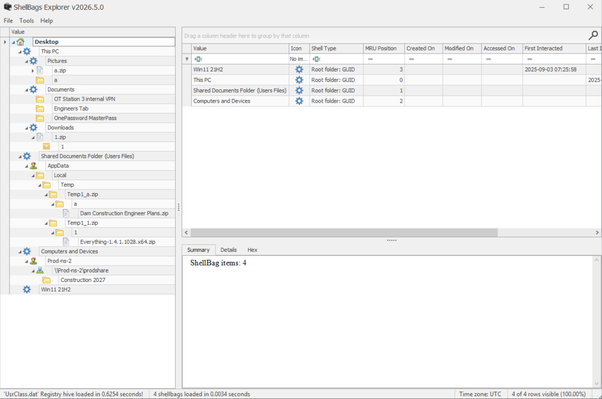
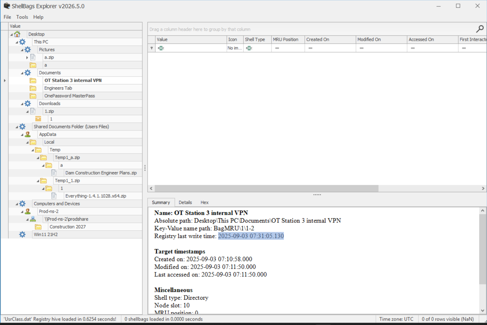
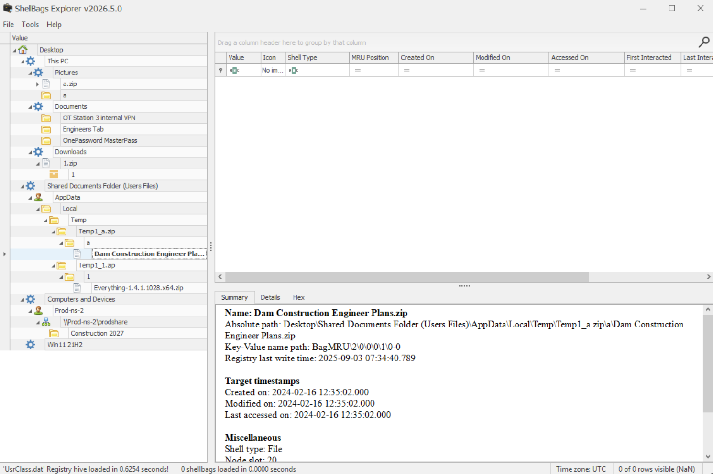
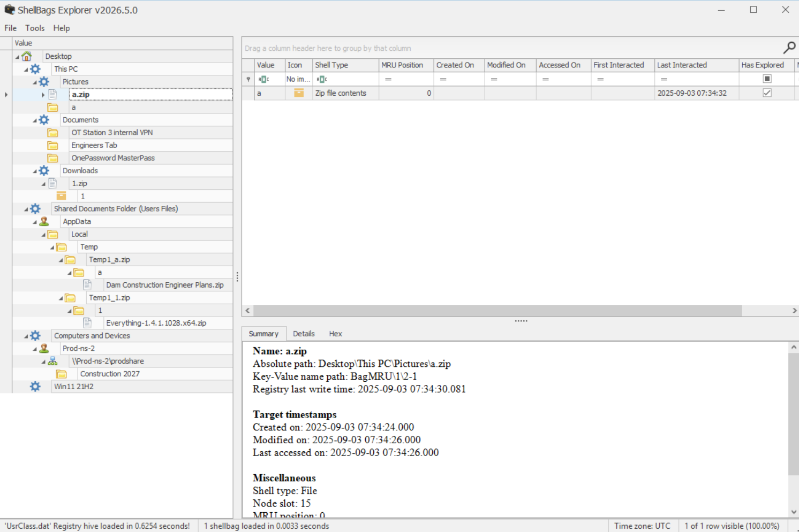

# Baggage
#### Categories: DFIR   Difficulty: Very Easy

## Sherlock Scenario
This Sherlock provides players with an opportunity to analyze Shellbag artifacts. Shellbags can be used to find evidence of folder access by a specific user, access to network shares, and navigation of archive file contents. This information can be leveraged during investigations to identify potential data access, data staging, and data exfiltration attempts.

## Attachments
- `Baggage.zip`

## Solve
After downloading and extracting the attachment, I obtained some artifact copy logs and a folder named `C`, which contains registry hives from the affected machine.

Since this sherlock focuses on Shellbags, I used **ShellBags Explorer** to parse the user hive at `C\Users\steve\AppData\Local\Microsoft\Windows\UsrClass.dat` and began the analysis.

 

### Task 1
#### Question:
What was the name of the archive file downloaded by the compromised account?

#### Answer:
Navigating to the `Downloads` folder reveals the archive file `1.zip`.

Answer: **1.zip**

 

### Task 2
#### Question:
What was the name of the utility brought in by the attacker to search for sensitive data?

#### Answer:
When `1.zip` was opened in Windows Explorer preview mode, a temporary folder named `Temp1_1.zip` was created, containing `Everything-1.4.1.1028.x64.zip`. *Everything* is a well-known, ultra-fast file and folder search utility for Windows.

Answer: **Everything 1.4.1.1028**

 

### Task 3
#### Question:
The attacker navigated the filesystem and found sensitive files used by the victim in their day-to-day work. When was the VPN folder accessed by the attacker?

#### Answer:
Inspecting the folder `OT Station 3 internal VPN` reveals the Last Write / Access timestamp recorded by Shellbags.

Answer: **2025-09-03 07:31:05**

 

### Task 4
#### Question:
What was the name of the directory containing the victim's passwords?

#### Answer:
Under the `Documents` directory, there is a folder named `OnePassword MasterPass`.

Answer: **OnePassword MasterPass**

 

### Task 5
#### Question:
The attacker also accessed a network share to pillage network data. What is the UNC path?

#### Answer:
The network share can be traced via `Desktop\Computers and Devices\Prod-ns-2`, which maps to the UNC path `\\Prod-ns-2\prodshare`.

Answer: **\\\Prod-ns-2\prodshare**

 

### Task 6
#### Question:
When is the dam construction planned?

#### Answer:
Inside the shared network folder, there is a directory named `Construction 2027`.

Answer: **2027**

 

### Task 7
#### Question:
What was the name of the archive file present on the network share?

#### Answer:
Under the temporary extraction artifacts in `Temp1_a.zip` (and inside the network share folder hierarchy), the archive file `Dam Construction Engineer Plans.zip` is present.

Answer: **Dam Construction Engineer Plans.zip**

 

### Task 8
#### Question:
When was the archive file from the network share accessed?

#### Answer:
Inspecting the `Dam Construction Engineer Plans.zip` directory entry provides the exact access timestamp.

Answer: **2025-09-03 07:34:04**

 

### Task 9
#### Question:
The attacker created a staging folder to prepare for collection and exfiltration. What is the full path of the staging folder?

#### Answer:
Under the `Pictures` directory, a staging folder named `a` was created and subsequently compressed into `a.zip` for exfiltration.

Answer: **C:\users\Steve\Pictures\a**

 

### Task 10
#### Question:
The attacker compressed the staging folder to prepare the data for exfiltration. When was the exfiltration archive file accessed?

#### Answer:
Checking the timestamps for the `a.zip` archive folder entry reveals the access time.

Answer: **2025-09-03 07:34:30**