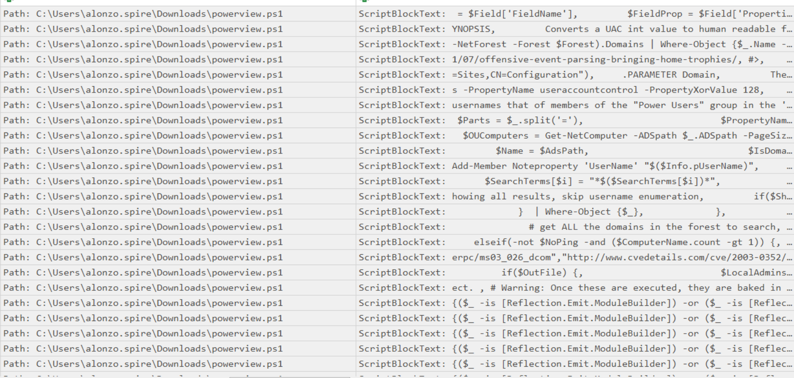

# Campfire-1
#### Categories: DFIR <br> Difficulty: Very Easy

## Sherlock Scenario
Alonzo Spotted Weird files on his computer and informed the newly assembled SOC Team. Assessing the situation it is believed a Kerberoasting attack may have occurred in the network. It is your job to confirm the findings by analyzing the provided evidence.

You are provided with:

1- Security Logs from the Domain Controller

2- PowerShell-Operational Logs from the affected workstation

3- Prefetch Files from the affected workstation

## Attachments
- `campfire-1.zip`

## Solve
After downloading and extracting the attachment, I obtained these artifacts: `SECURITY-DC.evtx`, `Powershell-Operational.evtx`, and the prefetch files. I used EvtxECmd and PECmd to parse them into `.csv` format so they could be analyzed using Timeline Explorer or Excel.

<br>

### Task 1
#### Question:
Analyzing Domain Controller Security Logs, can you confirm the UTC date & time when the kerberoasting activity occurred?

#### Answer:
In the `SECURITY-DC` log, filter for Event ID 4769 (`A Kerberos service ticket was requested`). Look for service names that are not `krbtgt` and do not end with `$`. The ticket encryption type should be `0x17` (`RC4-HMAC`), and the failure code (Status) should be `0x0` (Success). Record Number 256 satisfies all these conditions with the timestamp `2024-05-21 03:18:09`.
``` json
{"EventData":{"Data":[{"@Name":"TargetUserName","#text":"alonzo.spire@FORELA.LOCAL"},{"@Name":"TargetDomainName","#text":"FORELA.LOCAL"},{"@Name":"ServiceName","#text":"MSSQLService"},{"@Name":"ServiceSid","#text":"S-1-5-21-3239415629-1862073780-2394361899-1105"},{"@Name":"TicketOptions","#text":"0x40800000"},{"@Name":"TicketEncryptionType"},{"@Name":"TicketEncryptionType","#text":"0x17"},{"@Name":"IpAddress","#text":"::ffff:172.17.79.129"},{"@Name":"IpPort","#text":"58107"},{"@Name":"Status","#text":"0x0"},{"@Name":"LogonGuid","#text":"59f3b9b1-65ed-a449-5ac0-8ea1f68478ee"},{"@Name":"TransmittedServices","#text":"-"}]}}
```

Answer: **2024-05-21 03:18:09**

<br>

### Task 2
#### Question:
What is the Service Name that was targeted?

#### Answer:
The service name in Record Number 256 is `MSSQLService`.

Answer: **MSSQLService**

<br>

### Task 3
#### Question:
It is really important to identify the Workstation from which this activity occurred. What is the IP Address of the workstation?

#### Answer:
The client IP address associated with Record Number 256 is `172.17.79.129`.

Answer: **172.17.79.129**

<br>

### Task 4
#### Question:
Now that we have identified the workstation, a triage including PowerShell logs and Prefetch files are provided to you for some deeper insights so we can understand how this activity occurred on the endpoint. What is the name of the file used to Enumerate Active directory objects and possibly find Kerberoastable accounts in the network?

#### Answer:
The answer is found in the `Powershell-Operational` log. Filtering for Event ID 4104 (Script Block Logging) reveals the content of executed scripts. The reconnaissance commands originated from `powerview.ps1`.


Answer: **powerview.ps1**

<br>

### Task 5
#### Question:
When was this script executed? (UTC)

#### Answer:
The initial script execution is recorded in Record Number 16 with the timestamp `2024-05-21 03:16:32`.

Answer: **2024-05-21 03:16:32**

<br>

### Task 6
#### Question:
What is the full path of the tool used to perform the actual kerberoasting attack?

#### Answer:
Using PECmd to parse the prefetch files into CSV format and filtering for entries on `2024-05-21` (when the incident occurred), there is a notable executable entry at line 97 named `RUBEUS.EXE`—a well-known tool for Kerberos ticket attacks. By checking the loaded files column, I identified the full path of the executable.

Answer: **C:\Users\Alonzo.spire\Downloads\Rubeus.exe**

<br>

### Task 7
#### Question:
When was the tool executed to dump credentials? (UTC)

#### Answer:
The last run time recorded for `rubeus.exe` is `2024-05-21 03:18:08`.

Answer: **2024-05-21 03:18:08**