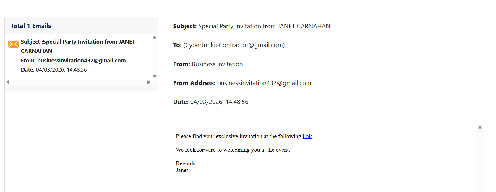
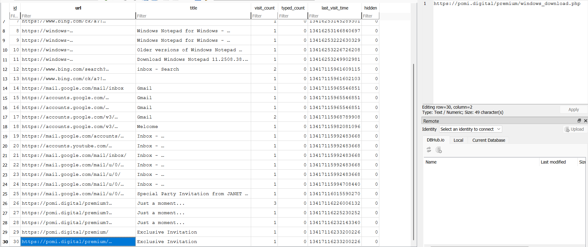
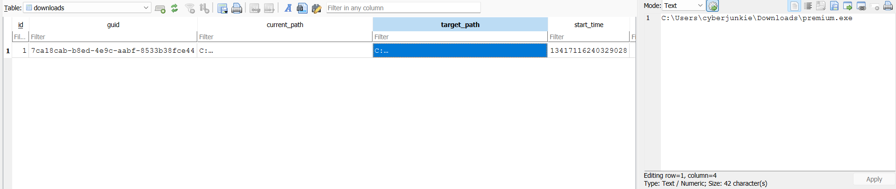
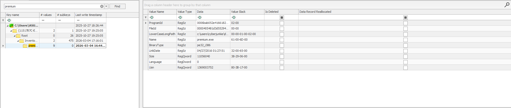
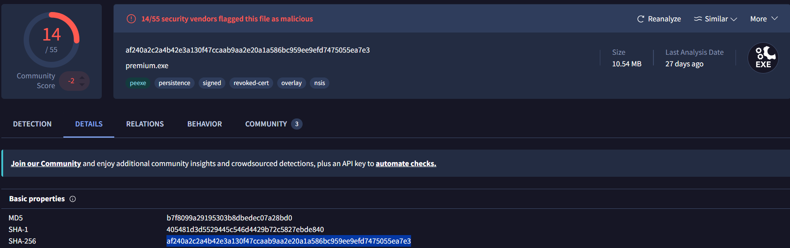
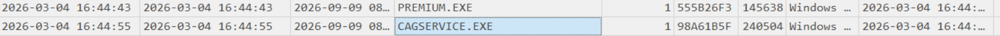
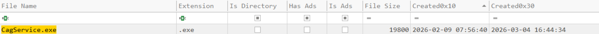
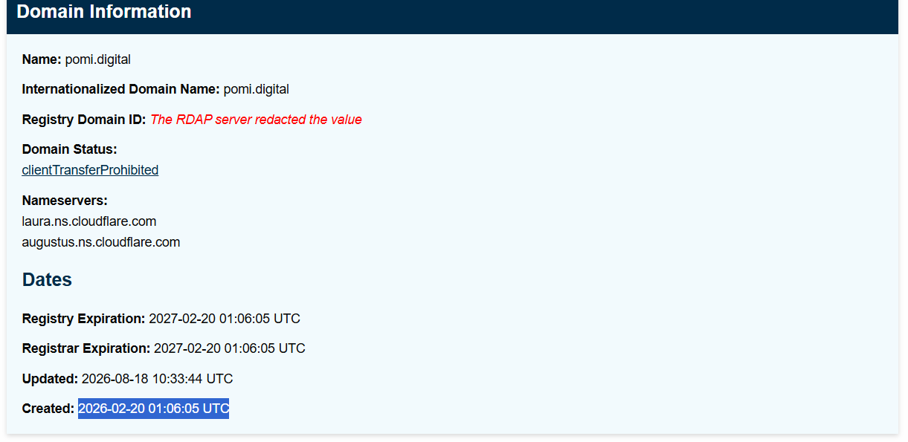
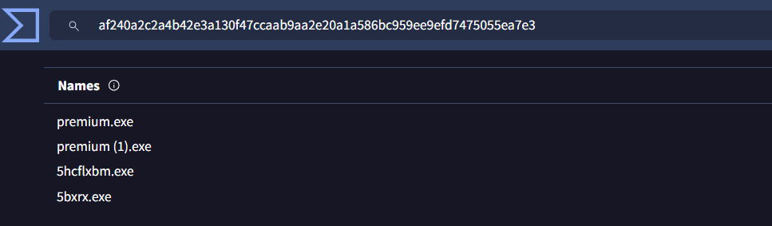

# Fruitzy
#### Categories: DFIR <br> Difficulty: Easy

## Sherlock Scenario
CyberJunkie started out as a junior QA Analyst at his friend's startup. He called the CEO of the startup because he believed he had mistakenly downloaded something malicious. The CEO sought help from you, his friend in the cybersecurity field. You sent him a guide on collecting evidence from the machine using KAPE. Now you have been given the forensic image so you can analyze and help your friends, as they cannot afford to hire an MSSP.

## Attachments
- `Fruitzy.zip`

## Solve
After downloading and extracting the attachment, I obtained a hard disk image named `2026-03-04T171958_forensicdata.vhdx` and an email file `Special Party Invitation from JANET CARNAHAN.eml`.

<br>

### Task 1
#### Question:
What is the Subject/topic of the Phishing email?

#### Answer:
Opening the `Special Party Invitation from JANET CARNAHAN.eml` in `emlreader`, the subject is identified as `Special Party Invitation from JANET CARNAHAN`.


Answer: **Special Party Invitation from JANET CARNAHAN**

<br>

### Task 2
#### Question:
What is the malicious URI that the malicious link redirected to?

#### Answer:
Using FTK Imager to analyze `2026-03-04T171958_forensicdata.vhdx`, I examined the browser history of user `cyberjunkie`. The `urls` table shows the destination URL `https://pomi.digital/premium/windows_download.php` that the malicious link redirected to. 


Answer: **`https://pomi.digital/premium/windows_download.php`**

<br>

### Task 3
#### Question:
What is the name of the downloaded file?

#### Answer:
From the browser's `downloads` table, the file name and full download path can be found.


Answer: **premium.exe**

<br>

### Task 4
#### Question:
When was the downloaded file executed by the victim according to Amcache?

#### Answer:
Extract the Amcache registry hive at `C:\Windows\AppCompat\Programs\Amcache.hve` and analyze it using Registry Explorer. Locating the downloaded file entry reveals its key Last Write timestamp.


>[!Note] 
> Amcache is a special Windows registry hive used to track Application Compatibility and Program Compatibility Assistant data. It serves as forensic evidence proving the existence and execution of executable files (PE binaries, scripts, installers) even if the file itself has been deleted.

Answer: **2026-03-04 16:44:33**

<br>

### Task 5
#### Question:
What is the SHA256 hash of the malicious executable downloaded from the phishing Website?

#### Answer:
The SHA-1 hash of the file is embedded within the `FileId` entry value by stripping the initial `0000` prefix:
```
405481d3d5529445c546d4429b72c5827ebde840
```

Searching this SHA-1 hash on VirusTotal reveals the corresponding SHA-256 hash of the downloaded malicious file.


Answer: **af240a2c2a4b42e3a130f47ccaab9aa2e20a1a586bc959ee9efd7475055ea7e3**

<br>

### Task 6
#### Question:
The user executed the file, but no invitation appeared or was found. They then used Microsoft Defender to scan the file. When was this scan initiated?

#### Answer:
Extract the Windows Defender operational event log at `C:\Windows\System32\Winevt\Logs\Microsoft-Windows-Windows Defender%4Operational.evtx`. Filtering for Event ID 1000 (`An antimalware scan started`) following the execution time reveals Record Number 336 with a Time Created timestamp of `2026-03-04 16:48:00`.

Answer: **2026-03-04 16:48:00**

<br>

### Task 7
#### Question:
The malware installed a Remote Monitoring and Management (RMM) tool as a backdoor for potential remote access. What was the service name?

#### Answer:
Analyzing Prefetch artifacts created after the execution time reveals that an executable named `CAGSERVICE.EXE` was launched shortly after `PREMIUM.EXE`. This process image belongs to the `CentraStage` service.


Record Number 1889 (Event ID 7045) in the `System` event log confirms this service installation:
``` json
{"EventData":{"Data":[{"@Name":"ServiceName","#text":"CentraStage"},{"@Name":"ImagePath","#text":"\"C:\\Program Files (x86)\\CentraStage\\CagService.exe\""},{"@Name":"ServiceType","#text":"user mode service"},{"@Name":"StartType","#text":"auto start"},{"@Name":"AccountName","#text":"LocalSystem"}]}}
```

Answer: **CentraStage**

<br>

### Task 8
#### Question:
The malicious backdoor installation time stomped the RMM executables. What was the modified timestamp set to these executables?

#### Answer:
This artifact is preserved in the `$MFT`. Filtering for `CAGSERVICE.EXE` reveals Entry Number 149731. The `$STANDARD_INFORMATION` (`Created0x10` / `Modified0x10`) timestamp was timestomped to `2026-02-09 07:56:40`.


Answer: **2026-02-09 07:56:40**

<br>

### Task 9
#### Question:
What is the name of the company whose product is the RMM tool?

#### Answer:
CentraStage was acquired and rebranded as Datto RMM, developed and maintained by Datto.

Answer: **Datto**

<br>

### Task 10
#### Question:
Pivoting back to the malicious link, when was the domain registered?

#### Answer:
Looking up the domain `pomi.digital` on `lookup.icann.org` displays the registration information along with its creation timestamp.


Answer: **2026-02-20 01:06:05**

<br>

### Task 11
#### Question:
Utilizing threat intelligence sources, what is another name for the executable that was initially downloaded?

#### Answer:
Alternative filenames associated with the malicious hash can be identified in the Names/Details section on VirusTotal.


Answer: **5bxrx.exe**