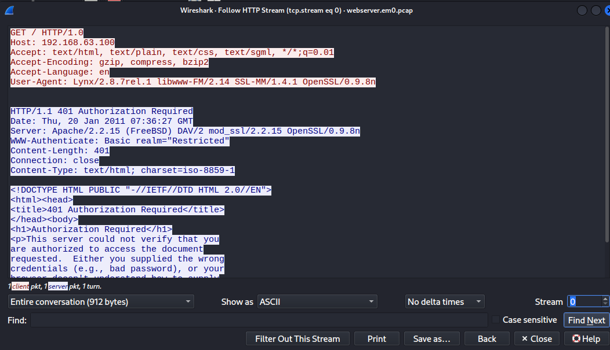
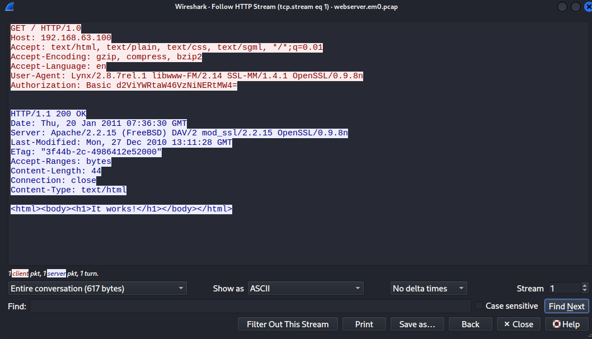

# Http_Basic_Auth
#### Categories: DFIR   Difficulty: Easy

## Sherlock Scenario
We receive a log indicating a possible attack, can you gather information from the .pcap file?
To connect to the challenge from pwnbox use the command:
xfreerdp /v:<ipaddress> /u:analyst /p:’123’ /cert:ignore /dynamic-resolution 
Log file: Desktop/ChallengeFile/webserver.em0.pcap
Note: pcap file found in public resources.

## Solve
After connecting to the Sherlock machine, I retrieved `webserver.em0.pcap`, which captures the web server network traffic.

 

### Task 0
#### Question:
How many HTTP GET requests are in pcap?

#### Answer:
Applying the display filter `http.request.method == "GET"` reveals 5 requests.

Answer: **5**

 

### Task 1
#### Question:
What is the server operating system?

#### Answer:
Following TCP stream 0, the `Server` header in the HTTP response discloses that the operating system is `FreeBSD`.

Answer: **FreeBSD**

 

### Task 2
#### Question:
What is the name and version of the web server software?

#### Answer:
Inspecting the `Server` banner from TCP stream 0 reveals the web server version: `Apache/2.2.15`.

Answer: **apache/2.2.15**

 

### Task 3
#### Question:
What is the version of OpenSSL running on the server?

#### Answer:
The `Server` header also specifies the OpenSSL module version: `OpenSSL/0.9.8n`.

Answer: **openssl/0.9.8n**

 

### Task 4
#### Question:
What is the client's user-agent information?

#### Answer:
Inspecting the `User-Agent` request header in the client's HTTP request shows the full client string.

Answer: **lynx/2.8.7rel.1 libwww-fm/2.14 ssl-mm/1.4.1 openssl/0.9.8n**

 

### Task 5
#### Question:
What is the username used for Basic Authentication?

#### Answer:
Filtering for successful connections reveals TCP stream 1. HTTP Basic Authentication encodes credentials in Base64 within the `Authorization` header, which can be easily decoded.

Answer: **webadmin**

 

### Task 6
#### Question:
What is the user password used for Basic Authentication?

#### Answer:
Decoding the Base64 string from the `Authorization` header yields the plaintext credentials `webadmin:w3b4dm1n`.

Answer: **w3b4dm1n**