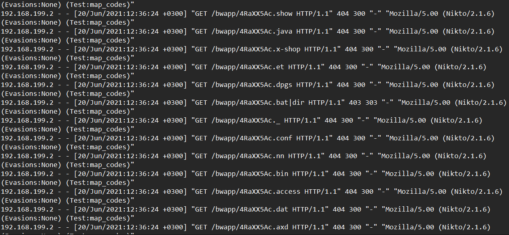
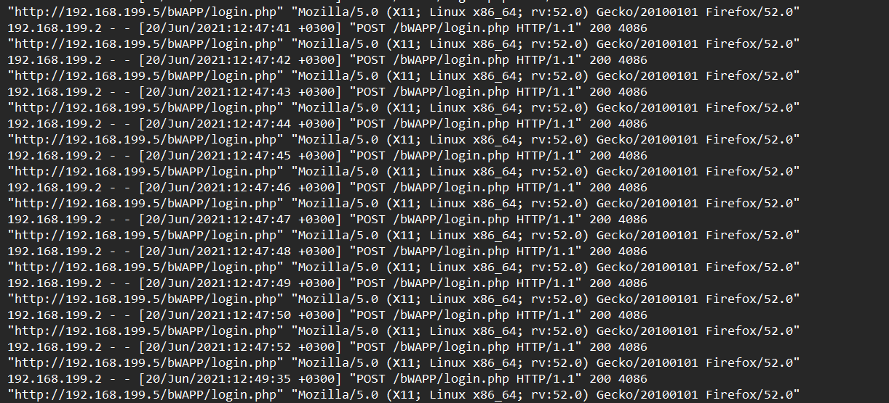
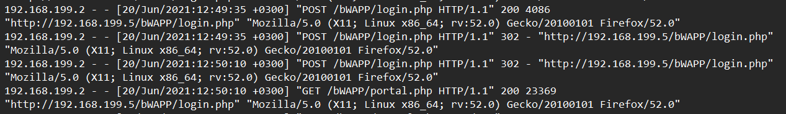
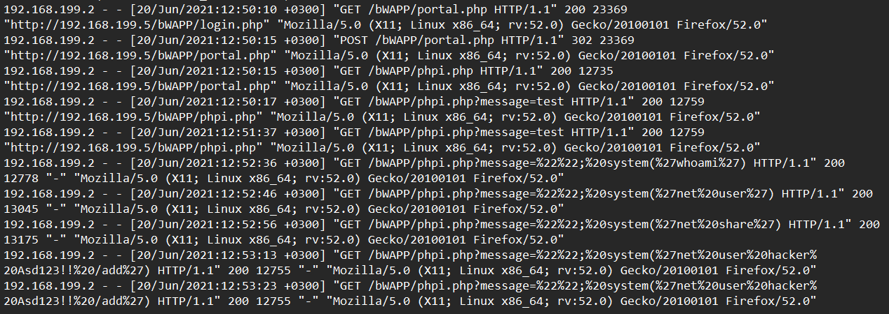

# IcedID_Malware_Family
#### Categories: DFIR   Difficulty: Easy

## Sherlock Scenario
We detected some web attacks and need to do deep investigation.
To connect to the challenge from pwnbox use the command:
xfreerdp /v:<ipaddress> /u:analyst /p:’123’ /cert:ignore /dynamic-resolution 
Challenge File: Desktop/ChallengeFile/access.log

## Solve
After connecting to the Sherlock machine, I retrieved `access.log`, which archives incoming HTTP connections to the web server.

 

### Task 0
#### Question:
Which automated scan tool did attacker use for web reconnaissance?

#### Answer:
A large volume of requests was made to various non-existent endpoints from `192.168.199.2`. Inspecting the User-Agent string reveals the use of the Nikto web vulnerability scanner.

Answer: **nikto**

 

### Task 1
#### Question:
After web reconnaissance activity, which technique did attacker use for directory listing discovery?

#### Answer:

Answer: **directory brute force**

 

### Task 2
#### Question:
What is the third attack type after directory listing discovery?

#### Answer:
The attacker repeatedly sent requests to the login page within a short timeframe, indicating a brute-force attack.

Answer: **brute force**

 

### Task 3
#### Question:
Is the third attack successful?

#### Answer:
Following several failed authentication attempts, the server returned an HTTP 302 redirect to `portal.php`. The subsequent request to `portal.php` responded with an HTTP 200 OK status code, confirming that the brute-force attack succeeded.

Answer: **yes**

 

### Task 4
#### Question:
What is the name of fourth attack?

#### Answer:
The attacker attempted to execute arbitrary system commands by injecting payloads into the URL parameters.

Answer: **code injection**

 

### Task 5
#### Question:
What is the first payload for 4th attack?

#### Answer:

Answer: **whoami**

 

### Task 6
#### Question:
Is there any persistency clue for the victim machine in the log file ? If yes, what is the related payload?

#### Answer:
Yes, the attacker attempted to establish persistence by creating a local backdoor user account named `hacker` with the password `asd123!!`.

Answer: **%27net%20user%20hacker%20asd123!!%20/add%27**