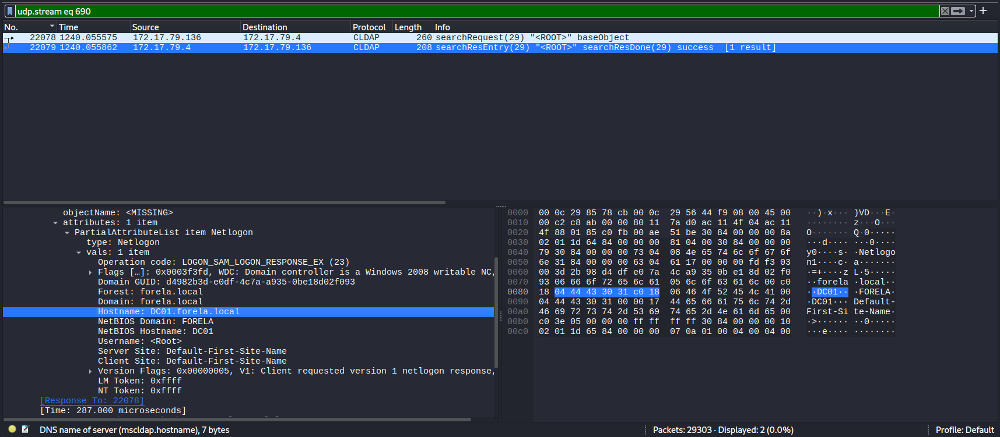
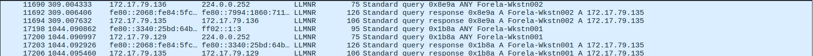
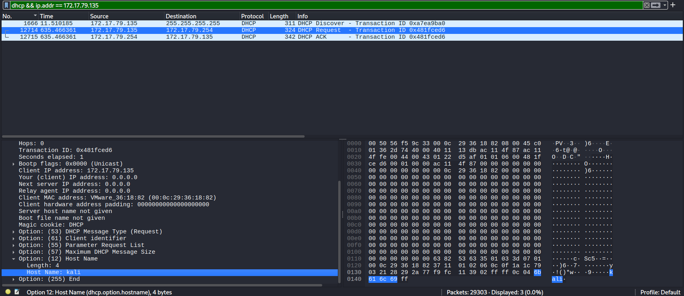
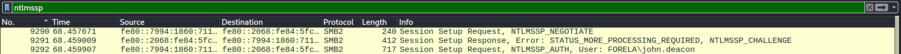
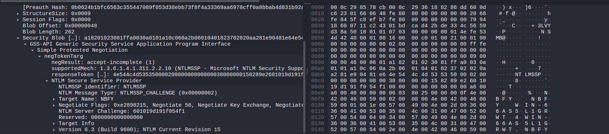
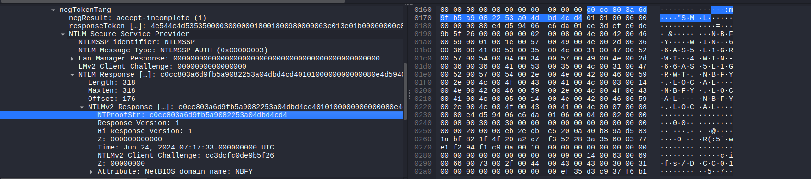
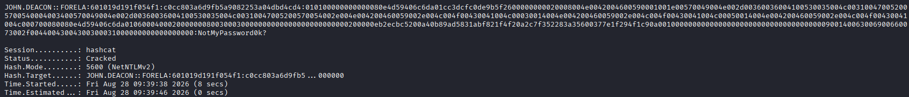

# Noxious
#### Categories: SOC <br> Difficulty: Very Easy

## Sherlock Scenario
The IDS device alerted us to a possible rogue device in the internal Active Directory network. The Intrusion Detection System also indicated signs of LLMNR traffic, which is unusual. It is suspected that an LLMNR poisoning attack occurred. The LLMNR traffic was directed towards Forela-WKstn002, which has the IP address 172.17.79.136. A limited packet capture from the surrounding time is provided to you, our Network Forensics expert. Since this occurred in the Active Directory VLAN, it is suggested that we perform network threat hunting with the Active Directory attack vector in mind, specifically focusing on LLMNR poisoning.

## Attachments
- `Noxious.zip`

## Solve
After downloading and extracting the attachment, I obtained the file `capture.pcap`. I used `Wireshark` to analyze the network artifacts.

<br>

### Task 1
#### Question:
Its suspected by the security team that there was a rogue device in Forela's internal network running responder tool to perform an LLMNR Poisoning attack. Please find the malicious IP Address of the machine.

#### Answer:
Opening `capture.pcap`, the first step is to identify the IP address of the legitimate Domain Controller. This can be accomplished by filtering for the `cldap` protocol. The response reveals that the Domain Controller has the hostname `DC01.forela.local` and the IP address `172.17.79.4`.


>[!Note] 
> CLDAP (Connectionless LDAP) is a protocol used in Active Directory for querying and managing directory objects over UDP port 389. When a client needs to locate a Domain Controller, the operating system triggers the DC Locator mechanism by sending a CLDAP Netlogon query. The response contains detailed internal metadata of the DC.

Filtering for `llmnr` reveals that the rogue machine (`172.17.79.135`) was responding to multicast queries sent by the victim workstation instead of the legitimate Domain Controller.


Answer: **172.17.79.135**

<br>

### Task 2
#### Question:
What is the hostname of the rogue machine?

#### Answer:
Filtering for DHCP traffic associated with the attacker's IP address (`dhcp && ip.addr == 172.17.79.135`) reveals the DHCP handshake packets. Inspecting the `Option: (12) Host Name` field inside the DHCP Request packet displays the actual hostname of the rogue machine.


Answer: **kali**

<br>

### Task 3
#### Question:
Now we need to confirm whether the attacker captured the user's hash and it is crackable!! What is the username whose hash was captured?

#### Answer:
The targeted username can be identified within the NTLMSSP authentication exchange (`ntlmssp`).


Answer: **john.deacon**

<br>

### Task 4
#### Question:
In NTLM traffic we can see that the victim credentials were relayed multiple times to the attacker's machine. When were the hashes captured the First time?

#### Answer:
The timestamp of the first captured authentication packet (packet 9290) is `2024-06-24 11:18:30`.

Answer: **2024-06-24 11:18:30**

<br>

### Task 5
#### Question:
What was the typo made by the victim when navigating to the file share that caused his credentials to be leaked?

#### Answer:
In the `LLMNR` query packets, the victim attempted to resolve the mistyped hostname `DCC01`.

Answer: **DCC01**

<br>

### Task 6
#### Question:
To get the actual credentials of the victim user we need to stitch together multiple values from the ntlm negotiation packets. What is the NTLM server challenge value?

#### Answer:
Inspecting the `NTLMSSP_CHALLENGE` packet (packet 9291) reveals the 8-byte NTLM Server Challenge.


Answer: **601019d191f054f1**

<br>

### Task 7
#### Question:
Now doing something similar find the NTProofStr value.

#### Answer:
Inspecting the subsequent `NTLMSSP_AUTH` packet (packet 9292) reveals the `NTProofStr` (HMAC-MD5 response) value.


Answer: **c0cc803a6d9fb5a9082253a04dbd4cd4**

<br>

### Task 8
#### Question:
To test the password complexity, try recovering the password from the information found from packet capture. This is a crucial step as this way we can find whether the attacker was able to crack this and how quickly.

#### Answer:
Constructing the NetNTLMv2 hash using the standard Hashcat format:
```
User::Domain:ServerChallenge:NTProofStr:NTLMv2Response(without first 16 bytes)
```
Complete NetNTLMv2 string:
```
john.deacon::FORELA:601019d191f054f1:c0cc803a6d9fb5a9082253a04dbd4cd4:010100000000000080e4d59406c6da01cc3dcfc0de9b5f2600000000020008004e0042004600590001001e00570049004e002d00360036004100530035004c003100470052005700540004003400570049004e002d00360036004100530035004c00310047005200570054002e004e004200460059002e004c004f00430041004c00030014004e004200460059002e004c004f00430041004c00050014004e004200460059002e004c004f00430041004c000700080080e4d59406c6da0106000400020000000800300030000000000000000000000000200000eb2ecbc5200a40b89ad5831abf821f4f20a2c7f352283a35600377e1f294f1c90a001000000000000000000000000000000000000900140063006900660073002f00440043004300300031000000000000000000
```

Cracking the hash with Hashcat using mode `5600`:


Answer: **NotMyPassword0K?**

### Task 9
#### Question:
Just to get more context surrounding the incident, what is the actual file share that the victim was trying to navigate to?

#### Answer:
Filtering for `smb2` traffic reveals packet 10214, which contains the `Tree Connect Request, Tree: '\\DC01\DC-Confidential'`.

Answer: **\\\DC01\DC-Confidential**