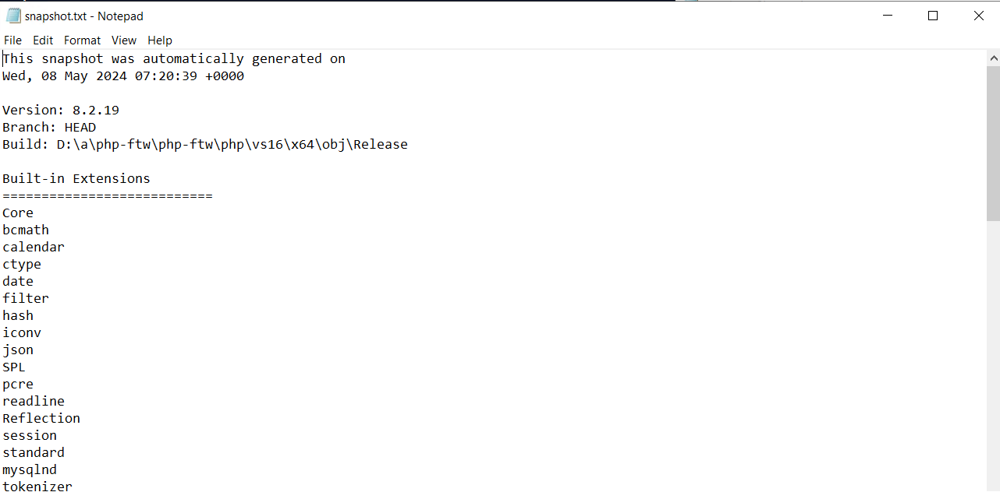
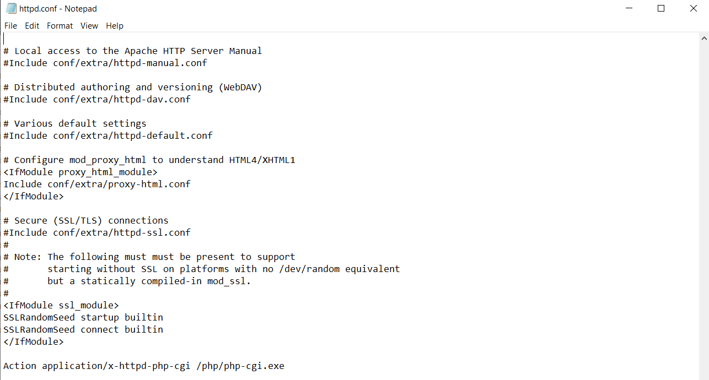
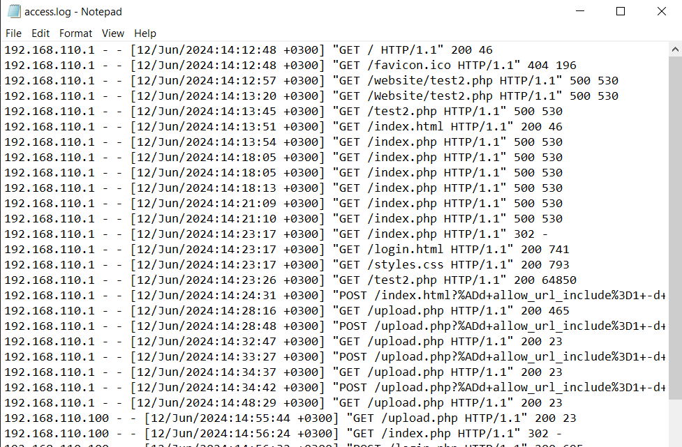
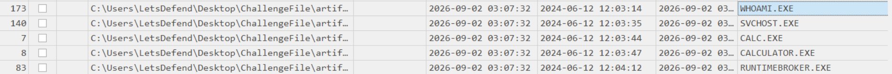

# PHP-CGI_(CVE-2024-4577)
#### Categories: DFIR   Difficulty: Easy

## Sherlock Scenario
You will confront an attempted exploitation of a newly discovered and unpatched vulnerability (CVE-2024-XXXX) in a critical software component within your organization's infrastructure. The CVE allows for remote code execution, posing a significant threat if successfully exploited. At 12:05 PM UTC, an alert is generated by the Intrusion Detection System (IDS) and Intrusion Prevention System (IPS), indicating an attack on one of your web servers. Your task is to analyze the provided artifacts, confirm the exploitation attempt, and answer the provided questions.

Connect to the VM with the credential provided using RDP. 
From pwnbox use the command 
xfreerdp /v:<ipaddress> /u:letsdefend /p:'' /cert:ignore /dynamic-resolution 
File Location: C:\Users\LetsDefend\Desktop\ChallengeFile\artifacts.7z

## Solve
After connecting to the Sherlock machine, I retrieved Apache server log and config, php config and prefetch from the web server.

 

### Task 0
#### Question:
What version of PHP was running on the server during the incident?

#### Answer:
Opening `php\snapshot.txt` shows the version of PHP.

Answer: **8.2.19**

 

### Task 1
#### Question:
When PHP is configured to run as CGI, which directive in httpd.conf specifies the scripts that handle requests for PHP files?

#### Answer:
The answer can be found in `httpd.conf` of Apache server config.

Answer: **Action**

 

### Task 2
#### Question:
What is the IP address of the attacker who attempted to exploit our server?

#### Answer:
In the Apache server access log, there are multiple POST requests originating from `192.168.110.1` containing malicious payloads aimed at achieving RCE.

Answer: **192.168.110.1**

 

### Task 3
#### Question:
The attacker targeted a specific page on the server with malicious payloads. Which page did the attacker target with malicious payloads?

#### Answer:
From the access log, the targeted page was `upload.php`.

Answer: **upload.php**

 

### Task 4
#### Question:
What version of Apache is running on the server?

#### Answer:
The first entry of the Apache error log reveals the version of the Apache server.

Answer: **2.4.59**

 

### Task 5
#### Question:
The attacker managed to execute commands on the server. What was the first process initiated by the attacker’s commands during their successful attempt?

#### Answer:
There are two clusters of malicious POST payloads in the access log: the first occurred between `14:24-14:34 UTC+3`, while the second occurred between `15:03-15:05 UTC+3`. The error log displays CGI execution errors during the first cluster, indicating that the initial attempt failed. Since no errors were recorded during the second cluster, we can narrow down our reference timeframe to that successful window.

Parsing the prefetch directory using PECmd reveals the initial process spawned by the attacker during this window.

Answer: **whoami.exe**

 

### Task 6
#### Question:
Before the attacker was detected and blocked, they executed another command, launching a new process. What process was launched by this command?

#### Answer:
Continuing the prefetch analysis right after `whoami.exe` execution within the same timeframe reveals the subsequent process spawned by the attacker.

Answer: **calc.exe**

 

### Task 7
#### Question:
What is the CVE number of the exploit used by the attacker?

#### Answer:
- CVE-2024-4577 is a Remote Code Execution (RCE) vulnerability affecting PHP when running on Windows in CGI mode.
- PHP previously implemented filters to prevent argument injection by blocking input arguments starting with a hyphen (`-`). Attackers can bypass this filter using a Soft Hyphen (`%ad` in URL encoding, Unicode `U+00AD`). When Windows applies its Best-Fit Mapping to convert characters into the system's code page before passing them to `php-cgi.exe`, it maps the soft hyphen back to an ASCII hyphen (`-` / `0x2D`), allowing arbitrary command-line argument injection and RCE.

NIST Reference: [CVE-2024-4577](https://nvd.nist.gov/vuln/detail/cve-2024-4577)

Answer: **CVE-2024-4577**