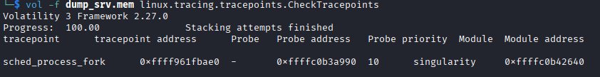
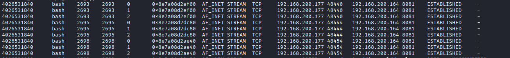
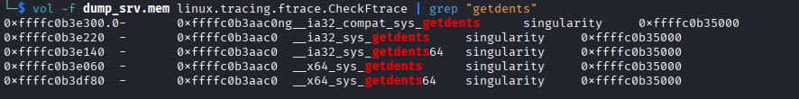
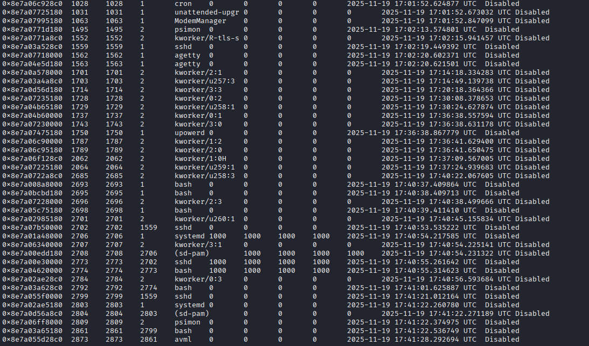
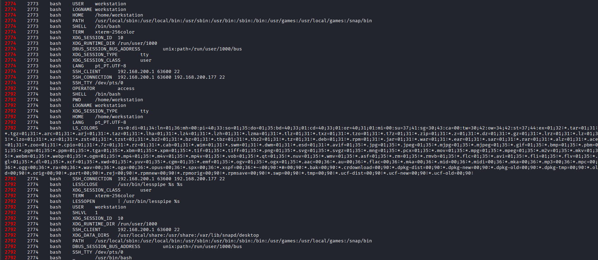

# Phantom
#### Categories: DFIR <br> Difficulty: Easy

## Sherlock Scenario
A Linux server in your organization has been exhibiting suspicious behavior. Network monitoring detected unusual outbound connections to an unknown IP address, and system administrators noticed that several standard diagnostic commands were returning incomplete information. A memory dump was captured from the compromised server before isolation. Your task is to analyze this memory dump to uncover evidence of a sophisticated rootkit infection, map its capabilities, and document all indicators of compromise.

## Attachments
- `Phantom.zip`

## Solve
After downloading and extracting the attachment, I obtained 2 files: `Ubuntu_6.8.0-87-generic.json`, `dump_srv.mem`. Compress `Ubuntu_6.8.0-87-generic.json` to `.xz` file
```
xz -k Ubuntu_6.8.0-87-generic.json
```
copy the compress file to `python3.13/site-packages/volatility3/framework/symbols/linux` to analysis by volatility3.

<br>

### Task 1
#### Question:
What is the name of the hidden kernel module?

#### Answer:
Loading an out-of-tree or unsigned module triggers kernel taint flags. We can use Volatility to inspect kernel messages for taint flags and identify non-standard modules loaded into the kernel:
``` bash
vol -f dump_srv.mem linux.kmsg | grep -i "taint"
```


>[!Note] 
> The Linux kernel serves as the core of the operating system. When an untrusted driver or arbitrary code is loaded into kernel space, the kernel marks itself as "tainted". <br>
> A Taint Flag is an integer bitmask (`tainted_mask`) within the kernel. Each bit represents a specific reason why the kernel is tainted:
> - O (Out-of-tree): The module was compiled outside the standard Linux kernel source tree.
> - E (Unsigned module): The module lacks a valid digital signature.
> - P (Proprietary): The module does not use a GPL-compatible open-source license.

The output confirms that the module `singularity` triggered both the `out-of-tree module` and `unsigned module` taint flags. Furthermore, it does not appear in the standard module list when running `linux.lsmod`, proving that it is an intentionally hidden rootkit kernel module:
``` bash
vol -f dump_srv.mem linux.lsmod
```

Answer: **singularity**

<br>

### Task 2
#### Question:
What kernel taint flags are set for the rootkit module? (comma-separated, alphabetical order)

#### Answer:
Based on the previous output, the two kernel taint flags set are `OOT_MODULE` and `UNSIGNED_MODULE`.

Answer: **OOT_MODULE,UNSIGNED_MODULE**

<br>

### Task 3
#### Question:
At what exact time (in seconds since boot) was the rootkit module loaded

#### Answer:
Because loading the rootkit module immediately triggers the taint flags, the timestamp of the first logged taint event corresponds directly to when the module was loaded.

Answer: **2490.473832**

<br>

### Task 4
#### Question:
What was the PID of the process that loaded the rootkit module?

#### Answer:
From the output in Task 1, the PID of the process responsible for loading the rootkit module is `2669`.

Answer: **2669**

<br>

### Task 5
#### Question:
Which kernel tracepoint is hooked by the rootkit

#### Answer:
Use Volatility to check for tracepoints hooked by the rootkit:
``` bash
vol -f dump_srv.mem linux.tracing.tracepoints.CheckTracepoints
```


>[!Note] 
> Hooking is a technique used to intercept function calls, messages, or events before they reach their original destination, altering behavior or inspecting sensitive data in transit.

>[!Note] 
> A Tracepoint is a static probe placed inside the Linux kernel source code by kernel developers. It allows tracing and profiling tools to attach custom callbacks safely without rewriting machine code or risking kernel panics.

Answer: **sched_process_fork**

<br>

### Task 6
#### Question:
What is the IP address of the command and control server?

#### Answer:
Use `sockstat` to inspect active network sockets and outbound connections:
``` bash
vol -f dump_srv.mem linux.sockstat
```


Processes `2693`, `2695`, and `2698` show that File Descriptors 0 (stdin), 1 (stdout), and 2 (stderr) are redirected into active TCP sockets (a standard `bash` process does not establish direct outbound TCP connections), confirming an active reverse shell.

Answer: **192.168.200.164**

<br>

### Task 7
#### Question:
What port is the C2 server listening on?

#### Answer:
The C2 server is listening on port 8081.

Answer: **8081**

<br>

### Task 8
#### Question:
What are the PIDs of the compromised bash processes connected to the C2 server? (comma-separated, ascending order)

#### Answer:
From the results in Task 6, the compromised bash process IDs are `2693`, `2695`, and `2698`.

Answer: **2693,2695,2698**

<br>

### Task 9
#### Question:
How many hooks has the rootkit installed?

#### Answer:
Use `ftrace` to identify the hooks installed by the rootkit and calculate the total count:
``` bash
vol -q -f dump_srv.mem linux.tracing.ftrace.CheckFtrace | grep "singularity" | sort | uniq | wc -l
```

Answer: **82**

<br>

### Task 10
#### Question:
Which function is hooked to hide IPv4 network connections?

#### Answer:
Use `ftrace` to identify functions hooked by the rootkit:
``` bash
vol -f dump_srv.mem linux.tracing.ftrace.CheckFtrace
```

The function hooked to conceal IPv4 network connections is `tcp4_seq_show`:
```
0xffffc0b3e3e0  -       0xffffc0b3aac0  tcp4_seq_show   singularity     0xffffc0b35000
```

Answer: **tcp4_seq_show**

<br>

### Task 11
#### Question:
How many variants of getdents syscalls are hooked?

#### Answer:
Use `ftrace` to determine the number of hooked `getdents` syscall variants used to hide malicious files, directories, and processes:
``` bash
vol -f dump_srv.mem linux.tracing.ftrace.CheckFtrace | grep "getdents"
```


>[!Note] 
> `getdents` (get directory entries) is a Linux system call used to read directory entries from a targeted directory structure.

Answer: **5**

<br>

### Task 12
#### Question:
Which function is hooked to enable an ICMP-based covert channel?

#### Answer:
The function hooked to enable an ICMP-based covert channel is `icmp_rcv`, which intercepts and embeds covert communication within ICMP packet payloads:
```
0xffffc0b422c0  -       0xffffc0b3aac0  icmp_rcv        singularity     0xffffc0b35000
```

Answer: **icmp_rcv**

<br>

### Task 13
#### Question:
What is the memory address of the centralized callback function? (Format:0x************)

#### Answer:
The memory address of the centralized callback function is `0xffffc0b3aac0`.
>[!Note] 
> A Centralized Callback Function acts as a unified dispatcher for all intercepted kernel functions across the system. This design prevents code fragmentation, simplifies CPU register state management, and mitigates kernel panic risks caused by changing kernel calling conventions.

Answer: **0xffffc0b3aac0**

<br>

### Task 14
#### Question:
What is the value of the suspicious environment variable which leads to the escalation of privileges?

#### Answer:
Use `pslist` to inspect currently running processes:
``` bash
vol -f dump_srv.mem linux.pslist
```


We can reconstruct the process tree as follows:
```
sshd connection (2702) -> unprivileged bash (2774) -> elevated bash (2792)
```
This indicates that the privilege escalation occurred between processes 2774 and 2792. Next, inspect the environment variables of these processes:
```
vol -f dump_srv.mem linux.envars.Envars | grep -E "^(2774|2792)\b"
```


`OPERATOR` is not a standard Linux or Bash environment variable. Its presence confirms that this variable acts as the rootkit's backdoor trigger for kernel-level privilege escalation.

Answer: **access**