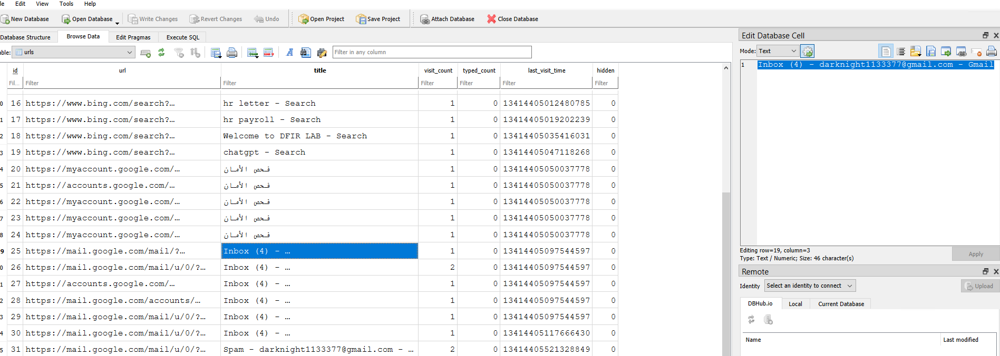
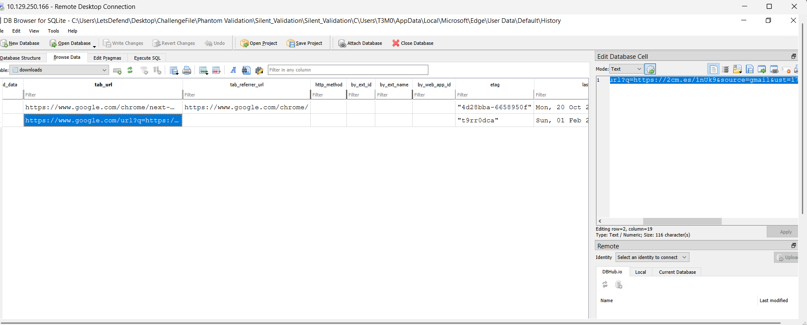
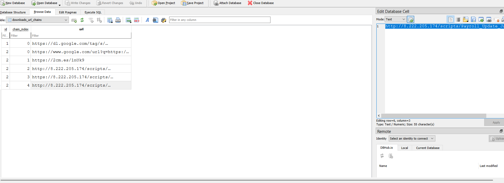
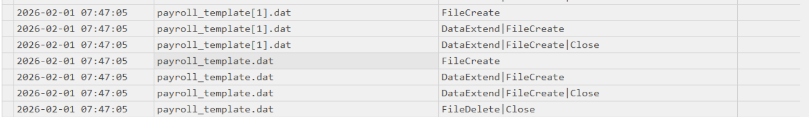

# PhantomValidation
#### Categories: DFIR <br> Difficulty: Easy

## Sherlock Scenario
A routine payroll-related communication triggered a series of user interactions on a corporate workstation. Following this activity, questions arose regarding external access, file handling, and system-level traces.

You are assigned to analyze the available artifacts and determine the nature and sequence of events.

From pwnbox use the command 
xfreerdp /v:<.ipaddress> /u:letsdefend /p:'' /cert:ignore /dynamic-resolution 

## Attachments
- `campfire-1.zip`

## Solve
After connecting to the Sherlock machine, I received `Phantom_Validation.zip`, which contains server-side Caddy access logs and a disk dump file from the victim's Windows workstation.

<br>

### Task 1
#### Question:
Which email address was associated with the user account that interacted with the payroll communication initiating this incident?

#### Answer:
The workstation has two browsers installed: Google Chrome and Microsoft Edge. Inspecting Edge's `History` SQLite database reveals that the user accessed Gmail using the account `darknight1133377@gmail.com`.


Answer: **darknight1133377@gmail.com**

<br>

### Task 2
#### Question:
What shortened URL was used to conceal the true destination of the payroll resource before redirection occurred?

#### Answer:
The payroll archive was downloaded by the user, so the initiator URL can be traced in the `downloads` table via the `tab_url` column.


Answer: **https://2cm.es/1nUk9**

<br>

### Task 3
#### Question:
After resolving the redirection, what was the actual URL hosting the payroll archive retrieved during the investigation?

#### Answer:
Examining the `downloads_url_chains` table reveals the final resolved URL hosting the downloaded payroll payload.


Answer: **http://8.222.205.174/scripts/Payroll_Update_January.zip**

<br>

### Task 4
#### Question:
Which file on disk initiated the execution chain that led to the retrieval of external content?

#### Answer:
Using MFTECmd to parse the `$MFT`, searching for newly created executable files extracted from `Payroll_Update_January.zip` bearing the `:Zone.Identifier` stream reveals `Payroll_Verification.cmd`.

>[!Note] 
> Mark-of-the-Web (MotW) is a Windows security mechanism designed to flag files downloaded from the Internet or untrusted sources. This metadata is stored as an Alternate Data Stream (ADS) named `Zone.Identifier` attached to the file on NTFS. Files extracted using native Windows Explorer inherit the MotW stream from the parent archive.

Answer: **Payroll_Verification.cmd**

<br>

### Task 5
#### Question:
At what exact time was the execution script first created on disk according to NTFS change records?

#### Answer:
Inspecting the NTFS Change Journal (`$UsnJrnl:$J`) records parsed by MFTECmd shows that the initial `FileCreate` event for `Payroll_Verification.cmd` occurred at `2026-02-01 07:46:07`.

Answer: **2026-02-01 07:46:07**

<br>

### Task 6
#### Question:
Which externally sourced file exhibited a create-and-delete lifecycle within the same execution window?

#### Answer:
Parsing `$UsnJrnl:$J` with MFTECmd and analyzing the file lifecycle around the execution timeframe reveals that `payroll_template.dat` underwent a rapid `FileCreate` followed immediately by a `FileDelete` sequence.


Answer: **payroll_template.dat**

<br>

### Task 7
#### Question:
What external resource was fetched as a direct result of the script execution?

#### Answer:
In `$UsnJrnl:$J`, right after the lifecycle of `payroll_template.dat` concluded, Prefetch file creation records for `certutil.exe` were observed. Inspecting the `CryptnetUrlCache` metadata directory at `C\Users\T3M0\AppData\LocalLow\Microsoft\CryptnetUrlCache\MetaData` reveals the file `A914B31ECD5AADC73465EE6B8B9EEBB3`, which contains the full remote URL fetched by Certutil.

Answer: **http://8.222.205.174/update/payroll_template.dat**

<br>

### Task 8
#### Question:
At what exact timestamp did the system successfully retrieve the external execution-related content?

#### Answer:
Filtering the Caddy access log for `/update/payroll_template.dat` reveals a successful HTTP 200 GET request with the User-Agent `Certutil URL Agent`. Converting the recorded epoch timestamp (`1769930609.7791772`) to UTC gives the exact retrieval time: `2026-02-01 07:23:29`.
```json
{
    "level": "info",
    "ts": 1769930609.7791772,
    "logger": "http.log.access.log0",
    "msg": "handled request",
    "request": {
        "remote_ip": "156.159.15.52",
        "remote_port": "54126",
        "client_ip": "156.159.15.52",
        "proto": "HTTP/1.1",
        "method": "GET",
        "host": "8.222.205.174",
        "uri": "/update/payroll_template.dat",
        "headers": {
            "Accept": [
                "*/*"
            ],
            "User-Agent": [
                "CertUtil URL Agent"
            ],
            "Cache-Control": [
                "no-cache"
            ]
        }
    },
    "bytes_read": 0,
    "user_id": "",
    "duration": 0.00021002,
    "size": 28,
    "status": 200,
    "resp_headers": {
        "Content-Type": [],
        "Last-Modified": [
            "Thu, 29 Jan 2026 19:47:38 GMT"
        ],
        "Accept-Ranges": [
            "bytes"
        ],
        "Content-Length": [
            "28"
        ],
        "Server": [
            "Caddy"
        ],
        "Etag": [
            "\"t9n5nes\""
        ]
    }
}
```

Answer: **2026-02-01 07:23:29**

<br>

### Task 9
#### Question:
Which native Windows utility was leveraged to retrieve the external resource without introducing third-party tools?

#### Answer:
Correlating the User-Agent signature (`Certutil URL Agent`) with host execution artifacts confirms that the native Windows utility leveraged for file retrieval was `certutil`.

Answer: **certutil**