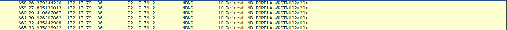

# Reaper
#### Categories: DFIR <br> Difficulty: Very Easy

## Sherlock Scenario
Our SIEM alerted us to a suspicious logon event which needs to be looked at immediately . The alert details were that the IP Address and the Source Workstation name were a mismatch .You are provided a network capture and event logs from the surrounding time around the incident timeframe. Corelate the given evidence and report back to your SOC Manager.

## Attachments
- `Reaper.zip`

## Solve
After downloading and extracting the attachment, I obtained the files: `SECURITY.evtx` and `ntlmrelay.pcapng`. I used `EvtxECmd` to parse the event log to `.csv` and `Wireshark` to analyze the network artifacts.

>[!Note] 
> NTLM is a suite of security protocols used to authenticate clients and servers on Windows networks.
> An NTLM relay attack is a technique where an adversary intercepts an NTLM authentication session and relays it to a target server to impersonate the victim user without cracking the password hash.

<br>

### Task 1
#### Question:
What is the IP Address for Forela-Wkstn001?

#### Answer:
Opening `ntlmrelay.pcapng` and filtering for the `nbns` protocol along with `Forela-Wkstn001` reveals periodic NetBIOS name refresh packets sent from `Forela-Wkstn001`, confirming its assigned IP address.


>[!Note] 
> NBNS (NetBIOS Name Service) is a name resolution service that maps hostnames to IP addresses in local Windows environments. NBNS operates via two mechanisms: P2P (Point-to-Point unicast to a WINS Server to register, refresh, or query names) and Broadcast (if a WINS Server is unavailable or fails to resolve the name, the machine broadcasts to the local subnet).

Answer: **172.17.79.129**

<br>

### Task 2
#### Question:
What is the IP Address for Forela-Wkstn002?

#### Answer:
Filtering for the `nbns` protocol and `Forela-Wkstn002` reveals NetBIOS name refresh packets originating from `Forela-Wkstn002` with its IP address.


Answer: **172.17.79.136**

<br>

### Task 3
#### Question:
What is the username of the account whose hash was stolen by attacker?

#### Answer:
- **Approach 1 (Network Capture):** After poisoning the victim's LLMNR query for an invalid hostname, the attacker lured the victim workstation into negotiating an NTLM session, revealing the authenticated user.


- **Approach 2 (Security Log):** In `SECURITY.evtx`, Record Number 4 records an incoming remote connection where the Workstation Name is `FORELA-WKSTN002` but the Source IP is `172.17.79.135` (the attacker's IP). This mismatch highlights an NTLM relay attack involving the `TargetUserName` `arthur.kyle`.
``` json
{"EventData":{"Data":[{"@Name":"SubjectUserSid","#text":"S-1-0-0"},{"@Name":"SubjectUserName","#text":"-"},{"@Name":"SubjectDomainName","#text":"-"},{"@Name":"SubjectLogonId","#text":"0x0"},{"@Name":"TargetUserSid","#text":"S-1-5-21-3239415629-1862073780-2394361899-1601"},{"@Name":"TargetUserName","#text":"arthur.kyle"},{"@Name":"TargetDomainName","#text":"FORELA"},{"@Name":"TargetLogonId","#text":"0x64A799"},{"@Name":"LogonType","#text":"3"},{"@Name":"LogonProcessName","#text":"NtLmSsp "},{"@Name":"AuthenticationPackageName","#text":"NTLM"},{"@Name":"WorkstationName","#text":"FORELA-WKSTN002"},{"@Name":"LogonGuid","#text":"00000000-0000-0000-0000-000000000000"},{"@Name":"TransmittedServices","#text":"-"},{"@Name":"LmPackageName","#text":"NTLM V2"},{"@Name":"KeyLength","#text":"128"},{"@Name":"ProcessId","#text":"0x0"},{"@Name":"ProcessName","#text":"-"},{"@Name":"IpAddress","#text":"172.17.79.135"},{"@Name":"IpPort","#text":"40252"},{"@Name":"ImpersonationLevel","#text":"%%1833"},{"@Name":"RestrictedAdminMode","#text":"-"},{"@Name":"TargetOutboundUserName","#text":"-"},{"@Name":"TargetOutboundDomainName","#text":"-"},{"@Name":"VirtualAccount","#text":"%%1843"},{"@Name":"TargetLinkedLogonId","#text":"0x0"},{"@Name":"ElevatedToken","#text":"%%1843"}]}}
```

Answer: **arthur.kyle**

<br>

### Task 4
#### Question:
What is the username of the account whose hash was stolen by attacker?

#### Answer:
From the `SECURITY` log examined in Task 3, the attacker performed the relay attack originating from IP `172.17.79.135`.

Answer: **172.17.79.135**

<br>

### Task 5
#### Question:
What was the fileshare navigated by the victim user account?

#### Answer:
After mistyping the initial network path (which triggered the LLMNR query and subsequent relay attack), the user attempted to navigate to the intended share path.

Filtering for `smb2` traffic in Wireshark and searching for packets returning `STATUS_BAD_NETWORK_NAME` reveals the attempted share path.


Answer: **\\DC01\Trip**

<br>

### Task 6
#### Question:
What is the source port used to logon to target workstation using the compromised account?

#### Answer:
The source port is recorded in the `IpPort` field of Record Number 4 (Event ID 4624) in the `SECURITY` log.

Answer: **40252**

<br>

### Task 7
#### Question:
What is the Logon ID for the malicious session?

#### Answer:
The Logon ID is identified in the `TargetLogonId` field of Record Number 4 in the `SECURITY` log.

Answer: **0x64A799**

<br>

### Task 8
#### Question:
The detection was based on the mismatch of hostname and the assigned IP Address.What is the workstation name and the source IP Address from which the malicious logon occur?

#### Answer:
As correlated in Task 3, the event logs show a mismatch between the workstation name and the initiating IP address.

Answer: **FORELA-WKSTN002, 172.17.79.135**

<br>

### Task 9
#### Question:
At what UTC time did the the malicious logon happen?

#### Answer:
Record Number 4 in the `SECURITY` log contains the timestamp `2024-07-31 04:55:16`.

Answer: **2024-07-31 04:55:16**

<br>

### Task 10
#### Question:
What is the share Name accessed as part of the authentication process by the malicious tool used by the attacker?

#### Answer:
Record Number 5 in the `SECURITY` log corresponds to Event ID 5140 (`A network share object was accessed`). The attacker's tooling accessed `IPC$`, an administrative hidden share used for inter-process communication and named pipe control following successful authentication.

Answer: **\\*\IPC$**