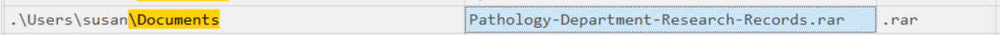
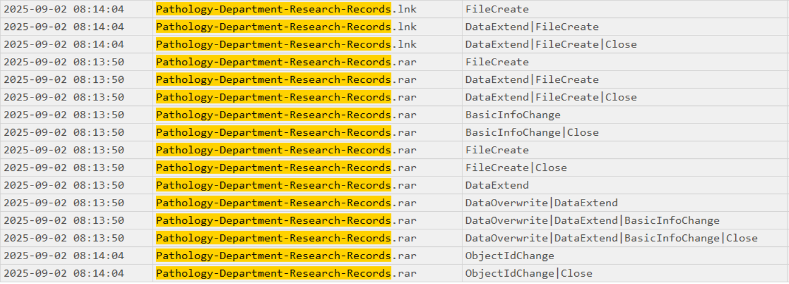
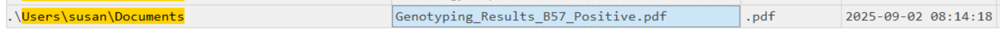
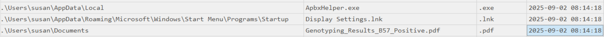
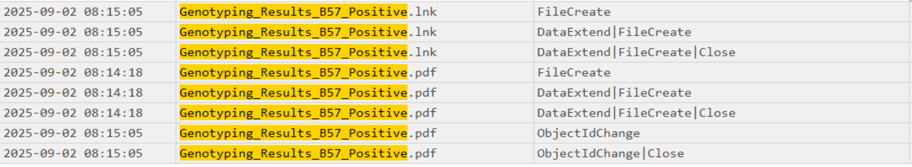

# Romcom
#### Categories: DFIR <br> Difficulty: Very Easy

## Sherlock Scenario
Susan works at the Research Lab in Forela International Hospital. A Microsoft Defender alert was received from her computer, and she also mentioned that while extracting a document from the received file, she received tons of errors, but the document opened just fine. According to the latest threat intel feeds, WinRAR is being exploited in the wild to gain initial access into networks, and WinRAR is one of the Software programs the staff uses. You are a threat intelligence analyst with some background in DFIR. You have been provided a lightweight triage image to kick off the investigation while the SOC team sweeps the environment to find other attack indicators.

## Attachments
- `RomCom.zip`

## Solve
After downloading and extracting the attachment, I obtained `2025-09-02T083211_pathology_department_incidentalert.vhdx`. Using FTK Imager to start analyzing.

<br>

### Task 1
#### Question:
What is the CVE assigned to the WinRAR vulnerability exploited by the RomCom threat group in 2025?

#### Answer:
- A path traversal vulnerability affecting the Windows version of WinRAR allows attackers to execute arbitrary code by crafting malicious archive files.
- Attackers exploit the NTFS Alternate Data Stream (ADS) Service Header to perform path traversal. Because WinRAR preserves NTFS metadata, the ADS stream header is processed during extraction, tricking WinRAR into traversing out of the target directory and writing files arbitrarily to any location on the system.
- Example malicious ADS path:
`sample.pdf:..\..\AppData\Roaming\Microsoft\Windows\Start Menu\Programs\Startup\malicious.exe`

NIST Reference: [CVE-2025-8088](https://nvd.nist.gov/vuln/detail/cve-2025-8088)

Answer: **CVE-2025-8088**

<br>

### Task 2
#### Question:
What is the nature of this vulnerability?

#### Answer:

Answer: **Path Traversal**

<br>

### Task 3
#### Question:
What is the name of the archive file under Susan's documents folder that exploits the vulnerability upon opening the archive file?

#### Answer:
Extract `$MFT` from `2025-09-02T083211_pathology_department_incidentalert.vhdx`, and use MFTECmd to parse this file to `.csv` format so it can be analyzed using Timeline Explorer or Excel.
```
MFTECmd.exe -f "$MFT" --csv ".\Output_Folder"
```
>[!Note] 
> The Master File Table (MFT) is the central database of NTFS. It tracks and stores path, size, permissions, and metadata for every file and folder on the volume.

Filtering for Susan's documents folder reveals the archive file `Pathology-Department-Research-Records.rar`.


Answer: **Pathology-Department-Research-Records.rar**

<br>

### Task 4
#### Question:
When was the archive file created on the disk?

#### Answer:
The creation timestamp can be found in the `Created0x10` column of the archive file record.

Answer: **2025-09-02 08:13:50**

<br>

### Task 5
#### Question:
When was the archive file created on the disk?

#### Answer:
Extract `$J` from `2025-09-02T083211_pathology_department_incidentalert.vhdx`, and use MFTECmd to parse this file to `.csv` format for analysis in Timeline Explorer or Excel.
```
MFTECmd.exe -f "$J" --csv ".\Output_Folder"
```
>[!Note] 
> The Update Sequence Number Journal (USN Journal) is an NTFS transaction log that records every sequential change (creations, renames, attribute modifications, deletions, etc.) applied to files and directories.

Searching for `Pathology-Department-Research-Records` shows that following extraction, the file was accessed/opened at `2025-09-02 08:14:04`, indicated by the `FileCreate` Update Reason on the corresponding `.lnk` file.


>[!Note] 
> The raw timestamp is `2025-09-02 08:14:04.9`. When viewed in Excel, the timestamp is rounded up to `2025-09-02 08:14:05`, but the exact timestamp recorded is `2025-09-02 08:14:04`.

Answer: **2025-09-02 08:14:04**

<br>

### Task 6
#### Question:
What is the name of the decoy document extracted from the archive file, meant to appear legitimate and distract the user?

#### Answer:
In Susan's documents folder, alongside the archive file, there is a `.pdf` file dropped as a decoy upon extraction.


Answer: **Genotyping_Results_B57_Positive.pdf**

<br>

### Task 7
#### Question:
What is the name and path of the actual backdoor executable dropped by the archive file?

#### Answer:
Since the malicious payload was dropped during archive extraction, we can correlate the creation timestamp of `Genotyping_Results_B57_Positive.pdf` to identify the dropped executable.


Answer: **C:\Users\Susan\Appdata\Local\ApbxHelper.exe**

<br>

### Task 8
#### Question:
The exploit also drops a file to facilitate the persistence and execution of the backdoor. What is the path and name of this file?

#### Answer:
Using the same timestamp correlation approach as Task 7:

Answer: **C:\Users\Susan\AppData\Roaming\Microsoft\Windows\Start Menu\Programs\Startup\Display Settings.lnk**

<br>

### Task 9
#### Question:
What is the associated MITRE Technique ID discussed in the previous question?

#### Answer:
The attacker established persistence by placing a shortcut (`.lnk`) file inside the Startup folder, which maps to MITRE ATT&CK technique T1547.009.

Answer: **T1547.009**

<br>

### Task 10
#### Question:
When was the decoy document opened by the end user, thinking it to be a legitimate document?

#### Answer:
Searching for `Genotyping_Results_B57_Positive` in the USN Journal confirms that after extraction, the decoy document was opened at `2025-09-02 08:15:05`, as indicated by the `FileCreate` Update Reason on its corresponding `.lnk` file.


Answer: **2025-09-02 08:15:05**